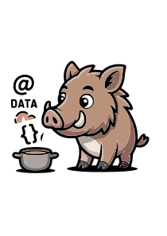

# Data Boar

**Data Boar — baseado na tecnologia lgpd_crawler.** Descoberta e mapeamento de dados pessoais e sensíveis com consciência de conformidade na sua sopa de dados.

**English:** [README.md](README.md) · [docs/USAGE.md](docs/USAGE.md)

---

## Para gestores e líderes de conformidade

Sua organização precisa saber **onde** estão os dados pessoais e sensíveis—para cumprir **LGPD**, **GDPR**, **CCPA**, **HIPAA**, **GLBA** e evitar surpresas custosas. O **Data Boar** ajuda a construir **consciência de conformidade** e a trazer à tona **possíveis violações** sem custo fora de controle: um único motor configurável que varre seus dados e reporta o que encontra, para que TI, cibersegurança, conformidade e DPOs possam agir com base em informação.

**O que trazemos à tona:** Além de PII óbvio (CPF, CNPJ — incluindo o novo formato alfanumérico, e-mail, telefone), usamos **IA** (ML e DL opcional) para detectar **categorias sensíveis** (saúde, religião, opinião política, biométrico, genético—LGPD Art. 5 II, GDPR Art. 9), **combinações de quasi-identificadores** (LGPD Art. 5, GDPR Recital 26) e **possíveis dados de menores** (LGPD Art. 14, GDPR Art. 8). Reconhecemos nomes regionais de documentos e sinalizamos identificadores ambíguos para confirmação manual, e revelamos exposição em **colunas legadas**, **exportações**, **dashboards** e **múltiplas fontes** em uma visão—para você enxergar lacunas que checagens manuais ou ferramentas só de regras costumam perder.

O risco real—**shadow IT** e além—costuma estar escondido em planilhas paralelas, pastas esquecidas, bancos legados, falta de padronização, fluxos confusos, aplicações mal documentadas, exceções e coleta excessiva de dados. O Data Boar segue farejando sua sopa de dados para trazer à tona esses ingredientes ocultos—incluindo arquivos renomeados ou mascarados e transporte ou armazenamento mais frágeis—para que conformidade e jurídico vejam o que de fato está lá, e não só a aparência.

**Faminto pela sua sopa de dados:** Como um **javali**, aprofundamos em várias fontes e não paramos na superfície. Sejam quais forem os ingredientes—**arquivos**, **SQL**, **NoSQL**, **APIs**, **Power BI**, **Dataverse**, **SharePoint**, **SMB/NFS** e outros—estamos prontos para ingerir e digerir. **Não armazenamos nem exfiltramos** PII, apenas **metadados** (onde foi encontrado, tipo de padrão, sensibilidade), para você obter visibilidade para remediação sem mover dados. Para um resumo objetivo para equipes jurídicas e de conformidade, veja [Conformidade e jurídico](docs/COMPLIANCE_AND_LEGAL.pt_BR.md).

**Por que sustenta:** Um único motor, **via configuração** (regex, termos ML/DL, norm tags, overrides de recomendação)—sem mudar código para alinhar a diferentes frameworks. **Relatórios Excel**, **heatmaps** e **tendências** entre sessões; varreduras **agendáveis** via API. Suportamos **LGPD**, **GDPR**, **CCPA**, **HIPAA**, **GLBA** prontos; **amostras de config** para **UK GDPR**, **EU GDPR**, **Benelux**, **PIPEDA**, **POPIA**, **APPI**, **PCI-DSS** e outras regiões estão em [docs/compliance-samples](docs/compliance-samples/) ([frameworks de conformidade](docs/COMPLIANCE_FRAMEWORKS.pt_BR.md)). Idiomas e encodings legados são suportados; **timeouts configuráveis** e **endurecimento de segurança** (validação, headers, auditoria) estão em vigor. **Arquivos compactados:** varredura dentro de zip, tar, gz, 7z via config, CLI ou dashboard; ver [USAGE](docs/USAGE.pt_BR.md). A detecção opcional de **content-type** ajuda a encontrar arquivos renomeados ou mascarados (ex.: PDF disfarçado de .txt); visibilidade inicial de **cripto/transporte** (ex.: TLS vs texto puro) é coletada para bancos e APIs. **Roadmap:** validação completa de cripto/controles, melhorias de detecção, SAP e outras fontes empresariais. O alinhamento com **ISO/IEC 27701** (PIMS), **SOC 2** e **FELCA** (mapeamento de dados de menores) está documentado; seguimos ampliando o suporte a normas auditáveis e regionais.

**Convidamos você a entrar em contato** para ver como o Data Boar pode apoiar sua jornada de conformidade.

**Cenários típicos:** Preparação para auditoria ou pedido do regulador; mapeamento de dados antes de migração ou implantação de DLP; conscientização de conformidade sem war room completo.

> **Release atual:** 1.6.4. Notas de release: [docs/releases/](docs/releases/) e a [página de Releases no GitHub](https://github.com/FabioLeitao/data-boar/releases).
> **Documentação:** Este README e o `docs/USAGE.pt_BR.md` são as referências em português. Quando funcionalidades ou opções mudarem, atualize **ambos** os idiomas para mantê-los sincronizados.

---

## Visão técnica

O Data Boar roda como auditoria **CLI de execução única** ou como **API REST** (porta padrão 8088) com dashboard web. Você configura **alvos** (bancos, filesystems, APIs, shares, Power BI, Dataverse) e **detecção de sensibilidade** (regex + ML, DL opcional) em um único arquivo de config **YAML ou JSON**. Ele grava achados e metadados de sessão em um banco **SQLite** local e gera **relatórios Excel** e um **heatmap PNG** por sessão.

| Se você precisa de…                                          | Veja                                                                                                                                     |
| -------------------                                          | -----                                                                                                                                    |
| Instalação, execução, referência CLI/API, conectores, deploy | [Guia técnico (pt-BR)](docs/TECH_GUIDE.pt_BR.md) · [Technical guide (EN)](docs/TECH_GUIDE.md)                                            |
| Esquema de configuração, credenciais, exemplos               | [USAGE.pt_BR.md](docs/USAGE.pt_BR.md) · [USAGE.md](docs/USAGE.md)                                                                        |
| Deploy (Docker, Compose, Kubernetes)                         | [deploy/DEPLOY.pt_BR.md](docs/deploy/DEPLOY.pt_BR.md) · [deploy/DEPLOY.md](docs/deploy/DEPLOY.md)                                        |
| Detecção de sensibilidade (termos ML/DL)                     | [SENSITIVITY_DETECTION.pt_BR.md](docs/SENSITIVITY_DETECTION.pt_BR.md) · [SENSITIVITY_DETECTION.md](docs/SENSITIVITY_DETECTION.md)        |
| Testes, segurança, contribuição                              | [docs/TESTING.pt_BR.md](docs/TESTING.pt_BR.md) · [SECURITY.pt_BR.md](SECURITY.pt_BR.md) · [CONTRIBUTING.pt_BR.md](CONTRIBUTING.pt_BR.md) |

**Início rápido (na raiz do repositório):** `uv sync` → prepare `config.yaml` (veja `deploy/config.example.yaml` e [USAGE](docs/USAGE.pt_BR.md)) → `uv run python main.py --config config.yaml` para execução única, ou `uv run python main.py --config config.yaml --web` para a API e o dashboard (bind padrão `127.0.0.1`, ex. <http://127.0.0.1:8088/>; use `--host 0.0.0.0` só com controles de rede). Lista de flags: `uv run python main.py --help`. **Não commite** o `config.yaml` da raiz (`.gitignore`); pode conter caminhos da LAN e segredos—veja a secção **Higiene do repositório público** em [CONTRIBUTING.pt_BR.md](CONTRIBUTING.pt_BR.md).

**Índice completo da documentação** (todos os tópicos e idiomas): [docs/README.md](docs/README.md) · [docs/README.pt_BR.md](docs/README.pt_BR.md).

**Licença e direitos autorais:** [LICENSE](LICENSE) · [NOTICE](NOTICE) · [docs/COPYRIGHT_AND_TRADEMARK.pt_BR.md](docs/COPYRIGHT_AND_TRADEMARK.pt_BR.md) ([EN](docs/COPYRIGHT_AND_TRADEMARK.md)).
