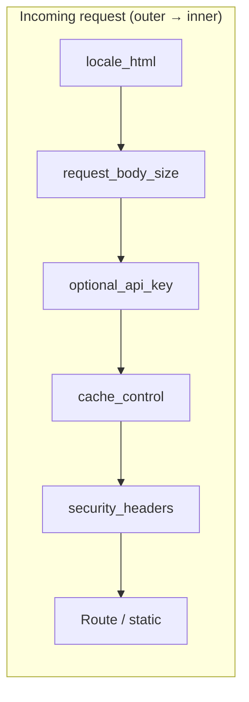
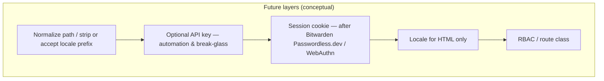

# Plan: Dashboard / reports access control (roles & permissions)

**Status:** Phase **0 (D-WEB)** design snapshot ✅ (route matrix + middleware Mermaid + proxy pointers — § *Phase 0 deliverable* below); **Phase 1a** (vendor-neutral **WebAuthn JSON RP** + SQLite — § *Phase 1a deliverable* below) ✅ on `main`; **Phase 1b** (browser session gates **HTML** on `/{locale}/…` + CSRF) + **Phases 2–3** ⬜ — [GitHub #86](https://github.com/FabioLeitao/data-boar/issues/86)

**Horizon / urgency:** `[H2]` / `[U2]` — after **Priority band A** and when multi-tenant / multi-user dashboard exposure is real, not before core scan stability.

**GitHub:** [Issue #86](https://github.com/FabioLeitao/data-boar/issues/86) (feature request; migrated narrative from Redmine-reports context).

**Where to read this topic:** This file is the **single planning source** for dashboard **access control**, **RBAC**, and **identity sequencing** (passwordless WebAuthn first, enterprise **SSO/OIDC** later). Related operator runbooks: [SECURE_DASHBOARD_AUTH_AND_HTTPS_HOWTO.md](../ops/SECURE_DASHBOARD_AUTH_AND_HTTPS_HOWTO.md) (API key + TLS today), [PLAN_OPERATOR_API_KEY_FIRST_AUTH_UX.md](PLAN_OPERATOR_API_KEY_FIRST_AUTH_UX.md) (ergonomics spike).

**Synced with:** [PLANS_TODO.md](PLANS_TODO.md) (GitHub issues queue + recommended sequence).

**Cluster (same code paths, different goals):** This plan is the **authorisation / exposure** slice for the HTML app. **[PLAN_DASHBOARD_I18N.md](completed/PLAN_DASHBOARD_I18N.md)** is the **locale** slice. They are **not duplicates**: merging them into one document would blur acceptance criteria (security vs translation). Do **entangle sequencing**: any work that changes **route layout** (e.g. `/{locale}/reports`) or **middleware stack** should consider both plans in the same sprint **design** pass—even if implementation stays in separate PRs. See **§ Relationship to other plans** below.

---

## Problem statement

Today, anyone who can reach the web UI can open **dashboard**, **reports list**, and (subject to path safety) **report downloads** when `api.require_api_key` is **false** (typical lab / trusted-network installs). A **single shared API key** (when `require_api_key: true`) applies **globally** via middleware: it does **not** distinguish “may run scans” vs “may only view reports” vs “config admin”. For **zero-trust** or **segregation-of-duties** goals, **reverse-proxy** path rules help but do not encode **in-app** RBAC/RAC.

---

## Type of work

| Label           | Note                                                                                   |
| ------------    | --------------------------------------------------------------------                   |
| **Feature**     | Permission or role gate on `/reports`, `/report`, `/reports/{id}`, heatmaps as needed. |
| **Security UX** | Reduces accidental exposure of compliance artefacts to the wrong audience.             |
| **Not a bug**   | Current behaviour is documented as deployment-dependent; tightening is **opt-in**.     |

---

## Workarounds (today — document, don’t block)

1. **Network / LB:** Restrict routes (`/reports`, `/report`, `/heatmap`) at reverse proxy; mTLS or VPN for admin paths.
1. **Global API key:** `api.require_api_key: true` — browsers need to send `X-API-Key` / `Authorization: Bearer` (clunky for pure HTML unless extended).
1. **Split listeners:** Internal bind for dashboard, no public ingress (Kubernetes `ClusterIP`, firewall).

See [SECURITY.md](../SECURITY.md), [USAGE.md](../USAGE.md), [TECH_GUIDE.md](../TECH_GUIDE.md) for deployment guidance.

---

## Target direction (phased — identity sequencing)

**Principle:** Ship **standards-based passwordless (FIDO2 / WebAuthn / passkeys)** as the **first in-app identity** path for humans, with **[Bitwarden Passwordless.dev](https://bitwarden.com/products/passwordless/)** as the **minimum** supported integration target (SDK + hosted API) so teams already on Bitwarden can align operationally. **Enterprise SSO** (Azure AD, Google Workspace, Okta, AWS IAM Identity Center–compatible OIDC, etc.) is a **later** phase: many mid-market customers do not have mature IdP rollout yet; passwordless in-product closes that gap.

**Alternative implementation:** The same WebAuthn flows can be implemented with **open-source** libraries (e.g. `py_webauthn` server-side) if a deployment must avoid a vendor dependency; acceptance criteria stay **interoperable passkeys**, not Bitwarden-exclusive.

| Phase | Scope | Outcome |
| ----- | ----- | ------- |
| **0** | Docs + **D-WEB** | Route matrix (what is public vs protected); proxy recipes; **middleware order** diagram with [PLAN_DASHBOARD_I18N.md](completed/PLAN_DASHBOARD_I18N.md) (`API key` → `locale` for HTML → `session` → `RBAC`). **2026-04:** `GET /status` and `GET /health` expose **`enterprise_surface`** (transport + license trust + global API-key surface + explicit `rbac: not_implemented`) for demo/enterprise narrative — not a substitute for Phase 2 RBAC. |
| **1** | **Session + passwordless (minimum)** | **HTTPS required** for WebAuthn. After successful WebAuthn (via Passwordless.dev or equivalent), issue **opaque server session** (**httpOnly cookie** + CSRF strategy) or short-lived internal JWT **separate** from commercial license JWT. **Global `api.require_api_key`** can remain for automation / break-glass; **browser** flows use session. **Schedule after [M-LOCALE-V1](completed/PLAN_DASHBOARD_I18N.md)** so HTML routes are already under `/{locale}/…`. |
| **2** | **RBAC** | Named roles (`scanner`, `reports_reader`, `config_admin`, …) bound to **authenticated subject**; route/resource gates on prefixed HTML paths; optional machine keys for API with role claims (design TBD). |
| **3** | **Enterprise SSO (optional)** | **OIDC** (SAML later if needed): map IdP groups → product roles; **coexist** with passwordless (e.g. local passkeys for break-glass, SSO for staff). |

**Non-goals for v1 of Phase 1–2:** Password **storage** as primary factor (passkeys first); full **SCIM** provisioning; replacing customer IdP — **SSO is additive in Phase 3**.

### Phase 1a deliverable — WebAuthn JSON relying party (shipped)

**Intent:** Ship **standards-aligned** registration/authentication **JSON** endpoints and credential persistence **without** a commercial passwordless SaaS SDK, so deployments stay **vendor-neutral** at the core ([ADR 0033](../adr/0033-webauthn-open-relying-party-json-endpoints.md)).

| Item | Notes |
| ---- | ----- |
| Endpoints | `POST /auth/webauthn/registration/options|verify`, `POST /auth/webauthn/authentication/options|verify`, `GET /auth/webauthn/status`, `POST /auth/webauthn/logout` — **404** when `api.webauthn.enabled` is false |
| Storage | SQLite table **`webauthn_credentials`**; cleared on `wipe_all_data` / `--reset-data` |
| Session | Signed **httpOnly** cookie (`itsdangerous`); **`api.require_api_key`** does not apply to `/auth/webauthn/*` |
| Limits | Challenge `state` is **in-memory** (single-worker); **one** registration while a credential row exists (**403** on second registration attempt) |
| Tests + smoke | `tests/test_webauthn_rp.py`, `tests/test_webauthn_session_cookie.py`; operator pytest subset: [SMOKE_WEBAUTHN_JSON.md](../ops/SMOKE_WEBAUTHN_JSON.md) |

**Explicitly not in 1a:** Gating **HTML** dashboard routes, **RBAC**, **CSRF** policy for locale-prefixed forms, **Bitwarden Passwordless.dev** adapter, **multi-worker** challenge store — those remain **Phase 1b+** / [#86](https://github.com/FabioLeitao/data-boar/issues/86).

### Phase 0 (D-WEB) — documentation-only slice (no WebAuthn yet)

**Intent:** Ship **one PR** that is **design + operator docs + diagram(s)** only. **Out of scope for that PR:** WebAuthn handlers, Bitwarden Passwordless.dev SDK wiring, session cookies, and new RBAC middleware — those belong to **Phase 1+**.

**Deliverables (checklist):**

1. **Route matrix** — ✅ table in § *Phase 0 deliverable — route matrix and middleware* (verify when routes change).
1. **Middleware order** — ✅ actual stack + Mermaid + **target** stack (session → locale → RBAC) in same section; [PLAN_DASHBOARD_I18N.md](completed/PLAN_DASHBOARD_I18N.md) cross-links here.
1. **Proxy recipes** — ✅ pointers to SECURITY + SECURE_DASHBOARD runbook in § *Phase 0 deliverable*; no product code in Phase 0.

**Identity roadmap (locked for sequencing — not implemented in Phase 0):**

| Order | Track | Notes |
| ----- | ----- | ----- |
| **1st** | **Passwordless for humans** | **[Bitwarden Passwordless.dev](https://bitwarden.com/products/passwordless/)** as the **minimum** supported integration for **Phase 1** (SDK + hosted API); align with teams already on Bitwarden. |
| **Later** | **Enterprise SSO** | **Phase 3** — OIDC (Azure AD, Google Workspace, Okta, IAM IC–compatible, …); **additive** after passwordless + RBAC are stable; coexist with passkeys for break-glass where needed. |

**Non-goals for Phase 0:** Choosing a final OIDC vendor; implementing SSO; storing passwords as a primary factor.

---

## Phase 0 deliverable — route matrix and middleware (snapshot)

**Purpose:** Single place for **D-WEB** — what exists on `main` today, how middleware runs, and **target** hooks for Phase 1 (session + Bitwarden Passwordless.dev) and Phase 3 (SSO). **No code changes** in this subsection; re-verify against `api/routes.py` when routes move (e.g. `/{locale}/…` per [PLAN_DASHBOARD_I18N.md](completed/PLAN_DASHBOARD_I18N.md)).

**Drift guard:** `tests/test_api_route_matrix_plan_sync.py` asserts the HTTP route set matches **`EXPECTED_HTTP_ROUTES`** — update that tuple **and** this table **in the same PR** whenever you add, remove, or rename routes in `api/routes.py`.

### HTTP routes (current shapes)

| Method(s) | Path | Response | Notes (today) | Target route class (future) |
| --------- | ---- | -------- | ------------- | ----------------------------- |
| `GET` | `/health` | JSON | **Always unauthenticated** (no API key); liveness/readiness | `public` |
| `POST` | `/auth/webauthn/registration/options` | JSON | **Phase 1 (optional):** WebAuthn creation options + `state` when `api.webauthn.enabled` — **404** when off; **no** global API key | `public` (handshake) |
| `POST` | `/auth/webauthn/registration/verify` | JSON | Verify registration; SQLite `webauthn_credentials`; sets cookie — **404** when off | `public` (handshake) |
| `POST` | `/auth/webauthn/authentication/options` | JSON | WebAuthn request options + `state` — **404** when off | `public` (handshake) |
| `POST` | `/auth/webauthn/authentication/verify` | JSON | Verify authentication; refresh cookie — **404** when off | `public` (handshake) |
| `GET` | `/auth/webauthn/status` | JSON | `{ enabled, registered_credentials, session_authenticated }` — **404** when off | `public` |
| `POST` | `/auth/webauthn/logout` | JSON | Clear session cookie — **404** when off | `public` |
| `GET` | `/{locale_slug}/help` | HTML | Help / doc links (`en`, `pt-br`, …) | `public` (or `authenticated` if product tightens) |
| `GET` | `/{locale_slug}/about` | HTML | About page | `public` |
| `GET` | `/{locale_slug}/assessment` | HTML | Optional POC placeholder (gated: `api.maturity_self_assessment_poc_enabled` + tier); **404** when off — [PLAN_MATURITY_SELF_ASSESSMENT_GRC_QUESTIONNAIRE.md](PLAN_MATURITY_SELF_ASSESSMENT_GRC_QUESTIONNAIRE.md). When answers exist in SQLite, HTML includes a **recent submissions** table (all batches in the DB file — **#86** should scope this list by role/tenant). | `authenticated` (TBD) |
| `POST` | `/{locale_slug}/assessment` | redirect | Save answers to SQLite when a YAML pack is configured; **400** without pack; **404** when gate off | `authenticated` (TBD) |
| `GET` | `/{locale_slug}/assessment/export` | CSV or Markdown attachment | Query `batch` (submit id) and `format` (`csv` or `md`); same POC gate + tier as `GET /assessment`; **404** if gate off, unknown batch, or no rows; **not** a write under `report.output_dir` (browser/curl download only) | `authenticated` (TBD) |
| `GET` | `/about/json` | JSON | Public license/about payload | `public` |
| `GET` | `/` | redirect | Unprefixed `/` → `302`/`307` to `/{negotiated}/` (cookie → `Accept-Language` → `locale.default_locale`) | n/a |
| `GET` | `/{locale_slug}/` | HTML | Dashboard (dashBOARd) | `authenticated` once session exists |
| `GET` | `/{locale_slug}/config` | HTML | View/edit YAML | `admin` or `authenticated` (TBD) |
| `POST` | `/{locale_slug}/config` | HTML | Save config | `admin` or mutating role |
| `GET` | `/{locale_slug}/reports` | HTML | Session list | `authenticated` |
| `POST` | `/scan`, `/start` | JSON | Start background scan | `scanner` or `authenticated` |
| `GET` | `/status` | JSON | Runtime status + `enterprise_surface` | `authenticated` or automation via API key |
| `GET` | `/report` | XLSX | Last report download | `reports_reader`+ |
| `GET` | `/heatmap` | PNG | Last heatmap | `reports_reader`+ |
| `GET` | `/list` | JSON | List API | `authenticated` / automation |
| `PATCH` | `/sessions/{session_id}` | JSON | Metadata | `authenticated` |
| `PATCH` | `/sessions/{session_id}/technician` | JSON | Technician tag | `authenticated` |
| `GET` | `/reports/{session_id}` | XLSX | Report by session | `reports_reader`+ |
| `GET` | `/heatmap/{session_id}` | PNG | Heatmap by session | `reports_reader`+ |
| `GET` | `/logs` | text | Logs listing | `authenticated` |
| `GET` | `/logs/{session_id}` | text | Session log | `authenticated` |
| `POST` | `/scan_database` | JSON | DB scan | `scanner`+ |

Static: `GET /static/...` (long cache; same process). **Today:** no per-route RBAC — global `api.require_api_key` only when enabled. **Locale:** see [PLAN_DASHBOARD_I18N.md](completed/PLAN_DASHBOARD_I18N.md) (M-LOCALE-V1); unprefixed legacy HTML paths (`/config`, `/reports`, `/help`, `/about`) redirect the same way as `/`.

### Middleware order (as implemented in `api/routes.py`)

Starlette/FastAPI: **the last `@app.middleware("http")` registered runs first** on the **incoming** request (outermost).

Registration order in code (first listed = innermost, closest to route):

1. `security_headers_middleware` — CSP, HSTS when HTTPS, etc. (runs **after** inner layers return, still participates in the stack).
2. `cache_control_middleware` — `Cache-Control` for `/static` vs no-store.
3. `optional_api_key_middleware` — if `api.require_api_key`, require key for **all paths except** `GET /health`.
4. `request_body_size_middleware` — reject body over 1 MB.
5. `locale_html_middleware` — unprefixed dashboard HTML paths → `/{slug}/…`; invalid locale segment → redirect; `Set-Cookie` for `db_locale` on successful locale HTML responses (**registered last** → runs **first** on incoming request).

**Incoming request path (outer → inner):**

`locale_html` → `request_body_size` → `optional_api_key` → `cache_control` → `security_headers` → **route handler** (or static mount).

### Target stack (Phase 1–3 — design only)

Not implemented yet. Intended **additions** (order still TBD with [PLAN_DASHBOARD_I18N.md](completed/PLAN_DASHBOARD_I18N.md) for `/{locale}/…`):

**Sequencing reminder:** **Bitwarden Passwordless.dev** (human, Phase 1) **before** enterprise **OIDC/SSO** (Phase 3). **API key** remains for scripts and probes alongside session for browsers where configured.

### Proxy / TLS

Operators terminating TLS upstream should set **`X-Forwarded-Proto: https`** so HSTS and `_is_secure_request` behave correctly — see [SECURITY.md](../SECURITY.md), [SECURE_DASHBOARD_AUTH_AND_HTTPS_HOWTO.md](../ops/SECURE_DASHBOARD_AUTH_AND_HTTPS_HOWTO.md).

---

## Demo / beta vs production-ready (passwordless path)

**Already in product today (baseline):** Optional global API key, TLS/plain-HTTP posture, rate limits, security headers — see [SECURITY.md](../SECURITY.md), [SECURE_DASHBOARD_AUTH_AND_HTTPS_HOWTO.md](../ops/SECURE_DASHBOARD_AUTH_AND_HTTPS_HOWTO.md).

| Gate | Demo / internal beta | Production-ready (passwordless minimum) |
| ---- | -------------------- | ---------------------------------------- |
| **Transport** | HTTPS with trusted cert (or lab-only exception documented) | **HTTPS everywhere** user-facing; HSTS where appropriate; no mixed-content WebAuthn |
| **Identity** | Shared API key or VPN-only dashboard | **WebAuthn** enrollment + login; session invalidation; **account recovery** policy (recovery codes / admin reset — TBD) |
| **Bitwarden / Passwordless.dev** | Dev tenant + test application | **Secrets** (API keys) via env / vault; **tenant** lifecycle documented; monitoring for API availability |
| **RBAC** | Single admin role or feature flags off | Roles enforced in middleware; **403** on forbidden routes; audit log entries for **sign-in** and **sensitive actions** (stretch) |
| **Data** | Single SQLite, single org | Backup/restore story; multi-user rows if needed; **no PII** in logs for WebAuthn assertions (handle per provider docs) |
| **Ops** | Manual deploy | Runbook: rotate sessions, revoke passkeys, disaster recovery; **Docker/K8s** secrets for Passwordless.dev keys |

**Beta exit criteria (suggested):** All **production-ready** rows satisfied in a **staging** environment; penetration-test pass on session + WebAuthn flows; operator docs (EN + pt-BR) updated.

---

## Mapping (earlier draft → current phases)

- **Route classes** (`public` / `authenticated` / `admin`) are implemented **inside** new **Phase 1–2** once **sessions** exist (not as “API key only” for HTML).
- **Old “Phase 3 IdP”** is now **explicitly** enterprise **SSO/OIDC** after passwordless + RBAC are stable.

---

## Dependencies & sequencing

- **Depends on:** Stable report path safety (already hardened); optional alignment with **commercial licensing / JWT** work ([LICENSING_SPEC.md](../LICENSING_SPEC.md)) if roles are carried in tokens.
- **Conflicts with:** None; additive flags, default preserves today’s behaviour until enabled.
- **Token-aware:** Treat as **one plan file + one implementation slice per session**; start with Phase 0–1 only.

### Sequencing with dashboard i18n ([PLAN_DASHBOARD_I18N.md](completed/PLAN_DASHBOARD_I18N.md))

**Shared risk:** Changing HTML routes **twice** (once unprefixed for RBAC, again for `/{locale}/…`) wastes review and tokens.

| Step               | Track                    | Action                                                                                                                                                                                                                                                                   |
| ----               | -----                    | ------                                                                                                                                                                                                                                                                   |
| **D-WEB**          | Both                     | **Design-only:** URL map + **middleware order** (optional API key for automation, **session** for browser after WebAuthn, locale resolution for HTML, route-class / RBAC). Cross-link between this file and the i18n plan.                                                                                                               |
| **Implementation** | i18n first (**required** before Phase 1 here) | **M-LOCALE-V1:** path-prefixed HTML + `en` / `pt-BR` JSON + negotiation; **no** new RBAC semantics required on first merge if defaults unchanged. **Promoted** ahead of #86 Phase 1 code.                                                                                                                        |
| **Implementation** | #86                      | Phase **0** (D-WEB) ✅. Phase **1+** **after** **M-LOCALE-V1** on the **same** prefixed paths (e.g. `/{locale}/reports`) — unless a **security exception** forces early guards on legacy paths (then budget a **migration** slice). |

Details and anti-footgun rules: **PLAN_DASHBOARD_I18N.md** § *Meshing with dashboard reports RBAC*.

---

## Completion checklist (when implementing)

- [x] USAGE + TECH_GUIDE (EN + pt-BR) updated for **Phase 1a** WebAuthn JSON; SECURITY cross-links remain via USAGE / deployment runbooks.
- [x] Tests: `tests/test_webauthn_rp.py`, `tests/test_webauthn_session_cookie.py` (disabled path, options+state, status, negative cases, startup without secret).
- [ ] Session cookies: **CSRF** strategy for **locale-prefixed** mutating routes when **Phase 1b** gates HTML — pending.
- [ ] This file + [PLANS_TODO.md](PLANS_TODO.md) + [SPRINTS_AND_MILESTONES.md](SPRINTS_AND_MILESTONES.md) refreshed; **close or narrow** GitHub #86 when **Phase 1b+** ships (1a alone does not close #86).

---

## Relationship to other plans (entangled, not merged)

| Plan / doc                                                                       | Overlap                                                                              | How to treat it                                                                                                                                                                                                          |
| ----------                                                                       | -------                                                                              | ----------------                                                                                                                                                                                                         |
| [PLAN_DASHBOARD_I18N.md](completed/PLAN_DASHBOARD_I18N.md)                                 | Same routes and templates (`/`, `/reports`, …).                                      | **Coordinate:** **M-LOCALE-V1** (locale prefix) **before** this plan’s **Phase 1** (session/passwordless); then **Phase 2+** RBAC on **prefixed** paths. i18n does not replace RBAC. |
| [LICENSING_SPEC.md](../LICENSING_SPEC.md) / commercial JWT                       | Product **license** claims (`dbtier`, …) vs **session** roles (`reports_reader`, …). | **Optional convergence** in a far enterprise phase: both might read JWT-shaped claims; keep **specs separate** until requirements are explicit—no need to fold this plan into licensing docs.                            |
| [completed/PLAN_RATE_LIMIT_SCANS.md](completed/PLAN_RATE_LIMIT_SCANS.md)         | GET `/reports`, `/heatmap` intentionally not rate-limited for reads.                 | **Compatible:** RBAC restricts *who*; rate limits restrict *how hard*. Changing either should mention the other in release notes.                                                                                        |
| [PLAN_SELENIUM_QA_TEST_SUITE.md](PLAN_SELENIUM_QA_TEST_SUITE.md)                 | Future E2E on dashboard flows.                                                       | When RBAC lands, QA plan should add cases for **forbidden** vs **allowed** roles on `/reports`.                                                                                                                          |
| [SECURITY.md](../SECURITY.md), [USAGE.md](../USAGE.md)                           | Deployment and `api.require_api_key`.                                                | **Phase 0** of this plan extends those docs; no separate “security plan” file required.                                                                                                                                  |
| [PLAN_OPERATOR_API_KEY_FIRST_AUTH_UX.md](PLAN_OPERATOR_API_KEY_FIRST_AUTH_UX.md) | Reducing JWT/manual-Bearer **toil** before RBAC complexity.                          | Exploratory spike: env + API key patterns for automation; **coordinate** if HTML flows need cookie/header UX (Phase 1 here).                                                                                             |

**Why keep a dedicated plan file:** Issue [#86](https://github.com/FabioLeitao/data-boar/issues/86) is a **trackable product ask** with its own phases and completion checklist. Folding it only into i18n or licensing would hide it from the **GitHub issues queue** table in [PLANS_TODO.md](PLANS_TODO.md).

---

## See also

- [SPRINTS_AND_MILESTONES.md](SPRINTS_AND_MILESTONES.md) §4.1 (*Identity: edge OIDC vs in-app passwordless*) and §5 (*Composing milestones*) — how **#86** fits the **M-ACCESS** story next to proxy-only patterns.
- [Bitwarden Passwordless.dev](https://bitwarden.com/products/passwordless/) — reference **minimum** integration for FIDO2 / WebAuthn / passkeys (product marketing + docs links from there).
- [PLAN_DASHBOARD_I18N.md](completed/PLAN_DASHBOARD_I18N.md) — locale (orthogonal concern; coordinate route/middleware design).
- [PLAN_NOTIFICATIONS_OFFBAND_AND_SCAN_COMPLETE.md](PLAN_NOTIFICATIONS_OFFBAND_AND_SCAN_COMPLETE.md) — operator channels (complementary ops story).
