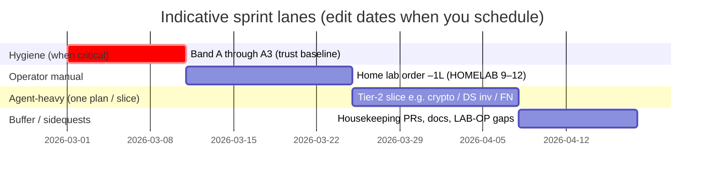

# Sprints, milestones, and light PM traceability

**Purpose:** Map [PLANS_TODO.md](PLANS_TODO.md) execution to **sprint-sized** focus windows, **milestones** you can celebrate, and optional **Gantt / Kanban** views—while staying **[token-aware](TOKEN_AWARE_USAGE.md)** and honest that **resources = you + agent** (not a PMO team). For a **full inventory** of plan files and one-line intent, see **[PLANS_HUB.md](PLANS_HUB.md)** ([pt-BR](PLANS_HUB.pt_BR.md)).

**Português (Brasil):** [SPRINTS_AND_MILESTONES.pt_BR.md](SPRINTS_AND_MILESTONES.pt_BR.md) — keep **EN + pt-BR** sections aligned when you change themes, milestones, or the SRE block.

**Policy:** [PLANS_TODO.md](PLANS_TODO.md) stays **English-only** for plan history. This **sprint/SRE guide** is intentionally **bilingual** (like operator-facing docs) so you can skim in pt-BR when tired. The doc does **not** replace `PLANS_TODO`; it **aggregates** the same order into time-boxed **themes**. After each sprint (or mid-sprint), refresh the [status dashboard](PLANS_TODO.md) with `python scripts/plans-stats.py --write` when table rows change.

---

## 1. How this relates to PMBOK / PRINCE2 (scaled down)

| Idea (big PM)               | Here (2-person, repo-centric)                                                                                                                                                                        |
| -------------               | -----------------------------                                                                                                                                                                        |
| **Charter / business case** | `README.md`, `PLANS_TODO.md` plan status line, commercial/licensing docs.                                                                                                                            |
| **Stages / phases**         | **Hygiene → Lab proof → Tier-2 feature slices → Release** (repeat). Sidequests (housekeeping, homelab “rush”) are **change requests**: they swap into the current sprint or get a **buffer** sprint. |
| **Work breakdown**          | Plan files + `PLANS_TODO` tables; **one row or one slice per agent session** when token-saving.                                                                                                      |
| **Roles**                   | **Operator:** manual (Hub, hardware, study, legal, merges). **Agent:** code/docs/tests/checklists in-repo.                                                                                           |
| **Monitoring**              | Git history, PRs, `plans-stats.py`, release notes under `docs/releases/`, optional GitHub Issues/Projects.                                                                                           |
| **Risk / quality**          | Priority band **A1–A3** before big feature bursts; `scripts/check-all.ps1`; home lab per [HOMELAB_VALIDATION.md](../ops/HOMELAB_VALIDATION.md).                                                      |

**PRINCE2-style tolerance:** For each sprint, define **time** (e.g. 1–2 weeks), **scope** (one primary theme + optional micro-fixes), and **quality** (tests + docs updated for shipped work). If scope explodes, **split** into the next sprint instead of inflating the current one.

---

## 2. Gantt-style visualization (Mermaid)

GitHub (and many Markdown previews) render **Mermaid** `gantt` blocks. The chart below uses **placeholder dates** only to show **relative sequencing**—not a commitment calendar. When you run a real sprint, copy the block and set dates to your sprint start, or use GitHub Milestones with due dates.

**Legend:** **O** = operator-led; **A** = agent-heavy; **M** = mixed.

**How to use without lying to the chart:** keep **one active “primary” bar** per calendar week; park the rest in **Backlog** (Kanban below). **Sidequests** consume the **buffer** lane or replace the feature lane for that week—explicitly.

---

## 3. Kanban-style board (Markdown mirror)

Copy this table into a GitHub **Project** board or a personal doc; move rows by **editing the Status** column each retro.

| Status          | Item                                                               | Owner                          | Source (plan order / doc)                                                                                                                                        |
| ------          | ----                                                               | -----                          | -------------------------                                                                                                                                        |
| **Backlog**     | Object storage connectors (S3-class) — plan only                   | A/M                            | [PLAN_OBJECT_STORAGE_CLOUD_CONNECTORS.md](PLAN_OBJECT_STORAGE_CLOUD_CONNECTORS.md)                                                                               |
| **Backlog**     | Dependabot / alerts triage                                         | M                              | `PLANS_TODO` –1, band A1 (cadence; **#195** closed a burst—revisit when new alerts)                                                                                                                                                |
| **Backlog**     | Docker Hub image rebuild + Scout                                  | M                              | –1b, A2 — after lockfile bumps on `main`, rebuild/push so Hub digest matches; then Scout                                                                                                                                          |
| **Backlog**     | Hub tag hygiene                                                    | **Operator**                   | A3                                                                                                                                                               |
| **Backlog**     | Home lab §1+§2 (+ connector)                                       | **Operator** (agent: doc gaps) | –1L, [HOMELAB_VALIDATION.md](../ops/HOMELAB_VALIDATION.md)                                                                                                       |
| **Backlog**     | FN reduction priorities 5+                                         | A/M                            | [PLAN_ADDITIONAL_DETECTION…](PLAN_ADDITIONAL_DETECTION_TECHNIQUES_AND_FN_REDUCTION.md)                                                                           |
| **Backlog**     | Strong crypto Phase 1                                              | A/M                            | `PLANS_TODO` order 4                                                                                                                                             |
| **Backlog**     | Data source inventory Phase 1                                      | A/M                            | order 5                                                                                                                                                          |
| **Backlog**     | Notifications Phase 1                                              | A/M                            | order 6                                                                                                                                                          |
| **Backlog**     | Dashboard **mobile responsive** (**M-MOBILE-V1**)                         | A                              | [PLAN_DASHBOARD_MOBILE_RESPONSIVE.md](PLAN_DASHBOARD_MOBILE_RESPONSIVE.md) — can ship **before** **D-WEB** / i18n; retest after locale or **#86** |
| **Backlog**     | Dashboard web surface **D-WEB** (i18n + #86 URL/middleware design) | A/M                            | [PLAN_DASHBOARD_I18N.md](completed/PLAN_DASHBOARD_I18N.md) § milestones; [PLAN_DASHBOARD_REPORTS_ACCESS_CONTROL.md](PLAN_DASHBOARD_REPORTS_ACCESS_CONTROL.md) § sequencing |
| **Backlog**     | Dashboard reports RBAC — **impl** (issue #86)                      | A/M                            | After **D-WEB**; target **prefixed** HTML paths; `[H2][U2]`                                                                                                      |
| **Backlog**     | Dashboard locale **M-LOCALE-V1** (implementation)                  | A                              | After **D-WEB** + schedule; [PLAN_DASHBOARD_I18N.md](completed/PLAN_DASHBOARD_I18N.md)                                                                                     |
| **Selected**    | **S1 – Lab proof** (–1L) + Tier-2 / HTTPS cluster when ready       | M + **Operator** (SSH/hardware) | [HOMELAB_VALIDATION.md](../ops/HOMELAB_VALIDATION.md) §1–§2+; then [PLANS_TODO](PLANS_TODO.md) orders **4–7** as scheduled                                                                                                               |
| **In progress** | *(one agent-heavy theme — e.g. FN slice, HTTPS, or dashboard CSS)* | —                              | See **Integration / WIP** in `PLANS_TODO`; keep a single WIP theme unless operator splits work                                                                                                                                   |
| **Blocked**     | *(waiting on operator: hardware, Hub, counsel)*                    | **Operator**                   | Note blocker in PR or private runbook                                                                                                                            |
| **Done**        | **S0 – Trust burst** (–1 **#195**; –1b Scout snapshot; **S0b** backup/restore **DEPLOY §9**) | M + Op (A3 Hub)                | **A3** tag hygiene still operator; **M-TRUST** mostly satisfied—see `PLANS_TODO` Integration                                                                                                                                        |

**Kanban WIP limit:** **1** primary feature theme in **In progress** for agent sessions; **operator** tasks (study, lab hardware) can run **in parallel** on calendar time but should not add a second **agent-heavy** theme without explicit agreement.

### 3.1 Study and certification lane (operator calendar)

- **Primary focus (2026):** **Paid cyber (CWL)** — finish **BTF → C3SA** then §3.2 sequence in [PORTFOLIO_AND_EVIDENCE_SOURCES.md](PORTFOLIO_AND_EVIDENCE_SOURCES.md); **credibility** = **those completions** + **shipped Data Boar** + compliance narrative. This repo’s editor may use **various** models; do **not** treat **Anthropic-only** study as the top lane.
- **Weekly cadence (suggested):** **2** CWL + **1** AI; next week **2** CWL + **1** other subject; repeat—see PORTFOLIO §3.0 and [OPERATOR_MANUAL_ACTIONS.md](../ops/OPERATOR_MANUAL_ACTIONS.md) §1. Ease off when band **A** or shipping spikes.
- **Alternating over the year:** **Anthropic Academy** (or other AI courses) when calendar allows — [Anthropic courses](https://docs.claude.com/en/docs/resources/courses); **CCA** = **capstone when eligible**, not a fixed deadline.
- **Same window:** Keep a **thin** **Priority band A** thread—see [PLANS_TODO.md](PLANS_TODO.md) **–1** / **–1b**.
- **Optional:** Third-party **completion certificates** (e.g. Cursor on Coursera)—HR polish only.
- **Retakes:** If **CCA** (or another exam) fails once, notes in `docs/private/` and **later** attempt.

---

## 4. Recommended sprints (aggregated, token-optimized)

Sprints are **themes** of 1–2 weeks wall-clock; inside each, you still execute **one slice per agent session** per [TOKEN_AWARE_USAGE.md](TOKEN_AWARE_USAGE.md). **Reorder** when Priority band **A** is red.

| Sprint                           | Theme             | Primary outcomes                                                                                                                                           | Operator moments (your calendar)                                    | Agent sessions (typical)                                       |
| ------                           | -----             | ----------------                                                                                                                                           | ----------------------------------                                  | ------------------------                                       |
| **S0 – Trust burst**             | Hygiene           | A1–A3 (min), –1, –1b green or documented                                                                                                                   | GitHub Security, Hub UI, approve/merge PRs                          | `pyproject`/lock/export, Dockerfile/Scout notes, small doc PRs |
| **S0b – Operability (optional)** | SRE slice         | One **readiness** item: runbook pointer, backup note, or KPI hook—see §7 and [PLAN_READINESS_AND_OPERATIONS.md](PLAN_READINESS_AND_OPERATIONS.md) §4.3–4.7 | You validate steps on a real deploy path                            | Short doc/script PR only; no new feature plan                  |
| **S1 – Lab proof**               | –1L               | HOMELAB baseline + ≥1 connector path; private dated note                                                                                                   | SSH, VMs, Docker on second host, record evidence in `docs/private/` | Fix playbook gaps, `docs/ops` only if you find contradictions  |
| **S2 – Detection depth**         | FN / hints        | One or two rows from FN plan (e.g. 5, 6, or 10–11)—**not all**                                                                                             | Config review on real data if needed                                | Implementation + tests + SENSITIVITY_DETECTION docs            |
| **S3 – Inventory / crypto**      | Tier-2 vertical   | **Either** Strong crypto Ph1 **or** Data source Ph1 (pick one sprint)                                                                                      | Validate report/CLI behaviour on a real scan                        | Schema, wiring, tests, EN+pt-BR operator docs                  |
| **S4 – Signals out**             | Notifications     | Phase 1 webhook (or first channel) + docs                                                                                                                  | Provide test webhook URL; decide channel policy                     | Config shape, module, examples                                 |
| **S5 – Buffer / maintenance**    | Sidequest control | Housekeeping PRs, operator-help sync, branch cleanup, LAB-OP private notes                                                                                 | Manual merges, cert study blocks (separate calendar)                | Small doc/test PRs; no new large plan                          |
| **S6+**                          | Repeat or defer   | Next row in “What to start next” or deferred tier                                                                                                          | As needed                                                           | Same one-slice discipline                                      |

### 4.0 S0 and S0b — execution checklist (when ready)

**Intent:** Run **S0 – Trust burst** when you have **1–3 focused sessions** (not mixed with a large feature slice). Optionally add **S0b – Operability** in the **same calendar week** if energy allows—it is **one small doc or script PR**, not a second feature theme.

#### S0 – Trust burst (maps to **M-TRUST** minimum)

Execute in **order** unless you are only documenting exceptions (still update [PLANS_TODO.md](PLANS_TODO.md) *Integration / WIP* when done).

| Step | ID | Action | Done when |
| ---- | -- | ------ | ---------- |
| 1 | **–1 / A1** | [Dependabot](https://github.com/FabioLeitao/data-boar/security/dependabot) + open PRs: bump deps safely; **`uv lock`**, **`uv export --no-emit-package pyproject.toml -o requirements.txt`**, **`.\scripts\check-all.ps1`**, merge when CI green. | Alerts triaged; lockfile + `requirements.txt` aligned; see [SECURITY.md](../SECURITY.md) SLAs. |
| 2 | **–1b / A2** | **`docker scout quickview`** / **`docker scout recommendations`** on **`fabioleitao/data_boar:latest`** (after image matches `main`); rebuild if base or deps fix CVEs. | Acceptable scan **or** documented base-image exception (e.g. Debian packages with no fix yet)—see *Integration / WIP* in PLANS_TODO. |
| 3 | **A3** | **Docker Hub** tag hygiene (operator): remove or document obsolete tags; align with [DEPLOY.md](../deploy/DEPLOY.md) §8. | Supported tags only; partners not pinning dead tags. |

**Optional same sprint:** **`uvx pip-audit -r requirements.txt`** re-check for [pygments](../ops/DEPENDABOT_PYGMENTS_CVE.md) / [pyOpenSSL + Snowflake](../ops/DEPENDABOT_PYOPENSSL_SNOWFLAKE.md) fix availability.

**Milestone:** **M-TRUST** (see [§5 Milestones](#5-milestones-every-few-sprints)) — mark progress in PLANS_TODO *plan status* line when A1–A3 are honestly green or documented.

#### S0b – Operability (optional; maps toward **M-OBS**)

Pick **exactly one** item—token-aware; operator validates on a real deploy path.

| Pick one | Where to implement | Done when |
| -------- | ------------------ | ---------- |
| **Runbook one-liner** | Extend [OBSERVABILITY_SRE.md](../OBSERVABILITY_SRE.md) or [DEPLOY.md](../deploy/DEPLOY.md): if the app is down → check **`GET /health`**, logs, `CONFIG_PATH`, disk/SQLite path, restart; if scan hangs → … | One short subsection; link from PLANS_TODO if useful. |
| **Backup / restore note** | [USAGE.md](../USAGE.md) and/or [DEPLOY.md](../deploy/DEPLOY.md): what to back up (config, SQLite, report dir); how to restore. | EN + pt-BR per docs policy. |
| **KPI hook** | Run **`python scripts/kpi-export.py --limit-prs 10`**; paste or file under `docs/releases/` (e.g. `kpi_snapshot.md`) or add a line to the next [release note](../releases/). | [PLAN_READINESS_AND_OPERATIONS.md](PLAN_READINESS_AND_OPERATIONS.md) §4.7 baseline updated in prose. |

**Study / certifications:** Treat as a **parallel swimlane** (operator-only). Slot **fixed blocks** (e.g. 1–2×/week) **after** one agent slice that day, not mixed with deep coding—per `TOKEN_AWARE_USAGE.md` §3 and [PORTFOLIO_AND_EVIDENCE_SOURCES.md](PORTFOLIO_AND_EVIDENCE_SOURCES.md) §3.2.

**Homelab “rush”:** Same as **S1** or **S5**; if it **interrupts** S2–S4, **rename** the sprint to “Lab interrupt” and **resume** the previous theme next—preserves narrative for retros.

### 4.1 Commercial entitlement, activation, and dashboard/API access (not yet a numbered sprint)

The table **S0–S6** does **not** yet include a dedicated row for **subscription vs lab vs consulting SKUs**, **stronger runtime activation/blocking**, or **authentication / RBAC** on the **dashBOARd** and **API**. Today, **Phase 1** licensing is in-repo ([`LICENSING_SPEC.md`](../LICENSING_SPEC.md): `open` / `enforced`, JWT, trial watermarking, revocation); **partner / tier / consulting** claims are a **documented future** extension—see **Priority band A** (A4 private issuer, A7 legal) in [PLANS_TODO.md](PLANS_TODO.md).

#### Recommended placement in the timeline

- **Do not defer** until “after all of Tier 2” if you will expose the UI/API beyond a **single trusted operator** on loopback. As soon as **M-LAB** is credible and you aim at **paid subscription** or **shared network** deploys, treat **M-ACCESS** (below) as a **first-class theme**—often **one focused sprint** **interleaved with S2–S4** (e.g. after **S1** or swapping with one Tier-2 slice), **not** only in **S6+**.
- **Order of work (pragmatic):** (1) **Legal + product:** SKU matrix (permanent subscription, trial, partner, lab/consulting) → JWT claims and issuer templates in the **private** issuer repo—**before** baking enforcement into sales contracts. (2) **Fast hardening:** document a **reference pattern** putting the app behind a **reverse proxy** with **OIDC** (e.g. OAuth2 Proxy, Traefik, Caddy) so Microsoft/Google/Entra-style login protects the surface **without** waiting for full in-app auth. (3) **In-app:** API keys or **Bearer** on sensitive routes; session or token gate for dashboard HTML/API used by the UI. (4) **RBAC:** roles such as viewer / operator / admin mapped to identity claims. (5) **Later:** first-class SSO integration, **TOTP**, **WebAuthn / passkeys** (passwordless, comparable to Microsoft Authenticator flows for Office 365). **Bitwarden** (or similar) fits best as **secrets vault** for deployment and client credentials—not usually as the primary **IdP**; align with the customer’s corporate identity (Entra ID, Okta, etc.).

#### Identity: edge OIDC vs in-app passwordless (same roadmap, not a contradiction)

- **Customer already has an IdP:** §4.1 step (2)—**reverse proxy + OIDC**—is the fastest way to protect the dashboard **without** shipping full in-app login first.
- **Mid-market / no mature SSO:** [PLAN_DASHBOARD_REPORTS_ACCESS_CONTROL.md](PLAN_DASHBOARD_REPORTS_ACCESS_CONTROL.md) (**#86**) sequences **WebAuthn / passkeys** (e.g. **Bitwarden Passwordless.dev** as minimum integration) **before** first-class enterprise **SSO** inside the product.
- **M-ACCESS** “done when” is satisfied by **documenting and smoke-testing** **at least one** supported pattern (**proxy-only**, **in-app session**, or **both** in different reference deploys).

- **Consulting / lab:** distinguish **entitlement** (what the token allows: e.g. consulting-only, row caps, watermark) from **authentication** (who opened the dashBOARd). Both are needed for a clean commercial story.

**Milestone:** **M-ACCESS** (see §5)—“subscription-ready” surfaces and documented identity path.

#### Prioritized follow-up slices (licensing controls + tiered capability packs)

| Priority | Slice                                                                       | Expected output                                                                                                                                             |
| ---      | ---                                                                         | ---                                                                                                                                                         |
| P1       | Define claim contract (`dbtier`, `dbfeatures`, optional `dbextras_profile`) | Draft schema + token examples in `LICENSING_SPEC`; no runtime gating yet.                                                                                   |
| P2       | Runtime gating matrix                                                       | Deterministic allow/deny table: Standard vs Pro/Partner vs Enterprise for optional features (including future AI heuristics and cloaking checks).           |
| P3       | Kill switch controls                                                        | Emergency disable path (token claim and/or revocation overlay) documented for operator and support playbooks.                                               |
| P4       | Dependency profile policy (`uv` extras)                                     | Installer/operator flow for allowed extras packs (`.[nosql]`, `.[datalake]`, etc.) per entitlement, with audit logging and no silent mutation during scans. |
| P5       | Operator-facing transparency                                                | Explicit docs + runtime info messages + report/audit fields so client/operator can see which entitlement controls are active.                               |

### 4.2 Dashboard web surface cluster (locale **+** issue #86)

**Plans:** [PLAN_DASHBOARD_I18N.md](completed/PLAN_DASHBOARD_I18N.md), [PLAN_DASHBOARD_REPORTS_ACCESS_CONTROL.md](PLAN_DASHBOARD_REPORTS_ACCESS_CONTROL.md), and [PLAN_DASHBOARD_MOBILE_RESPONSIVE.md](PLAN_DASHBOARD_MOBILE_RESPONSIVE.md) (responsive layout — **orthogonal** to locale). Same files (`api/routes.py`, templates, static CSS/JS, middleware); **separate acceptance criteria** (language vs authorization vs viewport).

**Mobile-first within this cluster (optional scheduling):** **M-MOBILE-V1** does **not** require **D-WEB** — ship responsive CSS/HTML on current URLs; when **M-LOCALE-V1** or **#86** change paths, run a **short mobile regression** pass.

**GRC maturity POC (related URLs, different theme):** Organizational questionnaire work ([PLAN_MATURITY_SELF_ASSESSMENT_GRC_QUESTIONNAIRE.md](PLAN_MATURITY_SELF_ASSESSMENT_GRC_QUESTIONNAIRE.md)) shares `api/routes.py` / templates with the dashboard but has **its own** backlog (consultant UX, **tenant-scoped** history / **RBAC** — [#86](https://github.com/FabioLeitao/data-boar/issues/86)). **Sequence:** bring that POC slice to a coherent checkpoint **before** prioritizing **#86** Phase 1 on a **separate branch** — Phase 1 remains **ASAP** **after** that checkpoint. **Checkpoint definition:** `smoke-maturity-assessment-poc.ps1` + runbook [SMOKE_MATURITY_ASSESSMENT_POC.md](../ops/SMOKE_MATURITY_ASSESSMENT_POC.md) §D (§E optional); the plan + runbook document **autonomous (CI/pytest) vs operator (browser)** so agents do not claim closure without §D. Cross-link: [PLANS_TODO.md](PLANS_TODO.md) *Integration / WIP* bullet *Maturity self-assessment*.

| Order | Item                           | Owner | Notes                                                                                                                                                                                                |
| ----- | ----                           | ----- | -----                                                                                                                                                                                                |
| 0     | **M-MOBILE-V1** (optional)     | A     | Responsive nav + tables + chart — [PLAN_DASHBOARD_MOBILE_RESPONSIVE.md](PLAN_DASHBOARD_MOBILE_RESPONSIVE.md). **Before** or **parallel** to locale work if operator prioritizes phone/tablet.        |
| 1     | **D-WEB**                      | A/M   | ✅ **Done** (route matrix + middleware — [PLAN_DASHBOARD_REPORTS_ACCESS_CONTROL.md](PLAN_DASHBOARD_REPORTS_ACCESS_CONTROL.md) § Phase 0).                                                            |
| 2     | **M-LOCALE-V1**                | A     | ✅ **Done** on **`main`** (**2026-04**) — prefixed HTML, `en` / `pt-BR` JSON, negotiation — [PLAN_DASHBOARD_I18N.md](completed/PLAN_DASHBOARD_I18N.md). **Before** row 4.                            |
| 3     | **M-MATURITY-POC** (checkpoint) | **Operator** (§D) + **A** (smoke/CI) | **Sequence gate** before **#86** Phase 1: milestone **M-MATURITY-POC** in [§5](#5-milestones-every-few-sprints) — automated gates via `smoke-maturity-assessment-poc.ps1`; **full** readiness needs runbook §D. **Product follow-up** (tenant-scoped history, consultant UX, DOCX→YAML) stays in [PLAN_MATURITY_SELF_ASSESSMENT_GRC_QUESTIONNAIRE.md](PLAN_MATURITY_SELF_ASSESSMENT_GRC_QUESTIONNAIRE.md) — not a blocker for row 4. |
| 4     | **#86 Phase 1+**               | A     | Session + passwordless (Bitwarden Passwordless.dev minimum) on **same** `/{locale}/…` paths — **dedicated branch/PR**; **ASAP** **after** row 3 reaches an agreed checkpoint (see paragraph above).   |

**Kanban:** Add **D-WEB** to **Backlog** or **Selected** when you schedule the design pass; keep **one** agent-heavy theme in **In progress** per [TOKEN_AWARE_USAGE.md](TOKEN_AWARE_USAGE.md).

### 4.3 Future public website (content split vs pitch) — **not active**

**Status:** Planning only — we are **not** building the site yet.

| Topic                       | Note                                                                                                                                                                                        |
| -----                       | ----                                                                                                                                                                                        |
| **Pitch / presentation**    | Private or stakeholder-facing **short** narrative (e.g. `docs/private/pitch/`); **low technical** depth; seeds **brand** only.                                                              |
| **GitHub compliance-legal** | `COMPLIANCE_AND_LEGAL`, frameworks, licensing — **governance** depth, not a full HOWTO site.                                                                                                |
| **Future website**          | **Deep** layer: USAGE, TECH_GUIDE, TESTING, Docker/deploy, scenarios, samples, **release notes**, **roadmap with named fronts**, **Docker Hub** + **GitHub**; **synced** to repo versions.  |
| **i18n**                    | Same **locale negotiation pattern** as **dashBOARd** ([PLAN_DASHBOARD_I18N.md](completed/PLAN_DASHBOARD_I18N.md), [PLAN_WEBSITE_AND_DOCS_I18N_FUTURE.md](PLAN_WEBSITE_AND_DOCS_I18N_FUTURE.md) §2.2). |
| **Cadence**                 | New **EN+pt-BR pitch deck generation** → **reminder** to schedule a **website** content/roadmap pass so public depth does not lag.                                                          |

---

## 5. Milestones (every few sprints)

Use GitHub **Milestones** or release tags; below is the **semantic** layer aligned with existing shipped work (e.g. **1.6.5**).

| Milestone           | Meaning                                                        | “Done when” (evidence)                                                                                                                                                                                                                                                                                                                                                                                                                                                                                                                                                                                                                                       |
| ---------           | -------                                                        | ----------------------                                                                                                                                                                                                                                                                                                                                                                                                                                                                                                                                                                                                                                       |
| **M-TRUST**         | Public artifacts trustworthy                                   | A1–A3 satisfied; plus runtime trust evidence path started (`M-TRUST-01`); Dependabot/Scout documented; image policy clear                                                                                                                                                                                                                                                                                                                                                                                                                                                                                                                                    |
| **M-OBS**           | Operability baseline (SRE)                                     | `/health` (and `/status` where relevant) documented for your deploy path; optional SLO sentence in ops doc; any **one** of: runbook one-liner, backup/restore note, KPI export hook—per [OBSERVABILITY_SRE.md](../OBSERVABILITY_SRE.md) + [PLAN_READINESS_AND_OPERATIONS.md](PLAN_READINESS_AND_OPERATIONS.md) §4.3–4.7                                                                                                                                                                                                                                                                                                                                      |
| **M-LAB**           | Second-environment confidence                                  | [HOMELAB_VALIDATION.md](../ops/HOMELAB_VALIDATION.md) §12 + dated private note                                                                                                                                                                                                                                                                                                                                                                                                                                                                                                                                                                               |
| **M-SCAN+**         | Tier-2 slice shipped                                           | One vertical released (crypto **or** data source **or** major FN slice) with tests + user-facing docs                                                                                                                                                                                                                                                                                                                                                                                                                                                                                                                                                        |
| **M-RICH**          | Data soup — rich media Tier 3                                  | **On `main`:** subtitles + optional metadata/OCR + magic-byte cloaking wired; `docs/releases/1.6.5.md` (or chosen patch); tests green — see [PLANS_TODO.md](PLANS_TODO.md) **Integration / WIP** while branch open                                                                                                                                                                                                                                                                                                                                                                                                                                           |
| **M-NOTIFY**        | Out-of-band awareness                                          | Notifications Ph1 usable with documented config                                                                                                                                                                                                                                                                                                                                                                                                                                                                                                                                                                                                              |
| **M-ACCESS**        | Paid / shared-network readiness (licensing + identity)         | Intended **commercial SKUs** and **enforced** path smoke-tested; tier claims + feature-pack policy (including kill switch path) documented; dashBOARd/API **not anonymously usable** on the reference deploy—via **documented proxy+OIDC pattern** and/or **in-app** auth; RBAC or equivalent role story documented for at least one pattern                                                                                                                                                                                                                                                                                                                 |
| **D-WEB**           | Dashboard web surface **design** (i18n ∩ #86)                  | URL map + middleware order **written** and cross-linked; **no** required product code (diagram + plan edits OK)                                                                                                                                                                                                                                                                                                                                                                                                                                                                                                                                              |
| **M-MOBILE-V1**     | Dashboard **usable on phone browsers**                         | As [PLAN_DASHBOARD_MOBILE_RESPONSIVE.md](PLAN_DASHBOARD_MOBILE_RESPONSIVE.md): nav + reports + home + config/help/about pass; **no** URL prefix change; docs + manual QA matrix                                                                                                                                                                                                                                                                                                                                                                                                                                                                                 |
| **M-LOCALE-V1**     | Dashboard HTML **locale v1**                                   | As [PLAN_DASHBOARD_I18N.md](completed/PLAN_DASHBOARD_I18N.md): prefixed HTML, `en`+`pt-BR`, negotiation, switcher, tests, CI key parity                                                                                                                                                                                                                                                                                                                                                                                                                                                                                                                                |
| **M-MATURITY-POC**  | GRC **self-assessment POC** checkpoint (before **#86** Phase 1) | **`smoke-maturity-assessment-poc.ps1`** + CI green on assessment tests; operator completes [SMOKE_MATURITY_ASSESSMENT_POC.md](../ops/SMOKE_MATURITY_ASSESSMENT_POC.md) §D (§E optional) for **full** demo readiness — [PLAN_MATURITY_SELF_ASSESSMENT_GRC_QUESTIONNAIRE.md](PLAN_MATURITY_SELF_ASSESSMENT_GRC_QUESTIONNAIRE.md) § *POC ready — evidence levels* |
| **M-SITE-READY**    | **First public website + technical doc hub** (GTM-ready slice) | **Live** static/marketing site with: (1) **non-technical** story pages (aligned with **stakeholder pitch**, not a dump of TECH_GUIDE); (2) **technical hub** — deep links or embedded paths to **version-aligned** USAGE, TECH_GUIDE, TESTING, deploy/Docker, scenarios, compliance-samples entry, **release notes**, **Docker Hub** + **GitHub**; (3) **roadmap** listing **specific active fronts** (connectors, dashboard, notifications, …); (4) **locale** UX **consistent** with dashBOARd i18n plan (prefix / cookie / `Accept-Language` / JSON catalogs). See [PLAN_WEBSITE_AND_DOCS_I18N_FUTURE.md](PLAN_WEBSITE_AND_DOCS_I18N_FUTURE.md) §2.1–2.3. |
| **M-RELEASE x.y.z** | Versioned product cut                                          | Existing VERSIONING checklist + `docs/releases/x.y.z.md` + Hub tags                                                                                                                                                                                                                                                                                                                                                                                                                                                                                                                                                                                          |

**Cadence suggestion:** **M-TRUST** before a big feature push; **M-OBS** can trail **M-TRUST** in the same or next sprint (small docs/automation); **M-LAB** before customer/demo storytelling; **M-RICH** when the rich-media PR merges; **M-ACCESS** before promising **permanent subscription** or **multi-user** production on a reachable host; **M-SITE-READY** when you intentionally ship a **public** doc/marketing surface (after **M-LOCALE-V1** is wise if you want matching locale UX); **M-RELEASE** whenever VERSIONING says ship.

### Composing milestones (release lifecycle map)

Use **milestone IDs** (the **M-** family: **M-TRUST**, **M-LAB**, …) and [VERSIONING](../releases/) for semver strings on tags. **Do not** treat this subsection as alternate product-stage naming: tokens such as **beta** or **rc** may still appear as **pre-release suffixes** on individual versions per policy—here we only describe **which milestone bundles** typically align with a **storytelling**, **hardening**, **commercial**, or **automation** posture.

| Narrative stage | Typical milestone bundle | Pointers |
| ----------------- | ------------------------ | ----- |
| **Stakeholder narrative / second environment** | **M-LAB** (minimum); optional **M-RICH**, **M-SCAN+** | Order **–1L** in [PLANS_TODO.md](PLANS_TODO.md); evidence per [HOMELAB_VALIDATION.md](../ops/HOMELAB_VALIDATION.md) + private dated note. |
| **Trust + operability baseline** | **M-TRUST**; **M-OBS** (at least one S0b item) | Before large feature bursts; runbook / backup / KPI cadence in [PLAN_READINESS_AND_OPERATIONS.md](PLAN_READINESS_AND_OPERATIONS.md). |
| **Shared-network / paid posture** | **M-ACCESS** | Licensing + identity path; §4.1 here + [PLAN_DASHBOARD_REPORTS_ACCESS_CONTROL.md](PLAN_DASHBOARD_REPORTS_ACCESS_CONTROL.md). |
| **Automation-ready ops (stretch)** | **M-OBS** “full” (runbook + backup + KPI habit); **M-NOTIFY**; optional hooks in [PLAN_READINESS_AND_OPERATIONS.md](PLAN_READINESS_AND_OPERATIONS.md) §4.7 | Reduces toil; **not** a hard gate for every **M-RELEASE**. |

**Dashboard / locale cluster** (**D-WEB**, **M-LOCALE-V1**, **#86**) is **orthogonal** to the rows above—schedule per §4.2 when promoted.

---

## 5.0 Trust sub-milestones (recommended for commercialization path)

To reduce ambiguity inside **M-TRUST**, use these small checkpoints:

- **M-TRUST-01:** trust-state contract wired (status/log/report/audit baseline).
- **M-TRUST-02:** confidence-gated output behavior active for degraded/untrusted states.
- **M-TRUST-03:** crypto baseline self-check surfaced at runtime.
- **M-TRUST-04:** review packet format used in one external review cycle.

**Dependency supply chain (PyPI + GitHub Actions):** committed lockfile, **`pip-audit`** in CI, **Dependabot** (pip + actions), **SHA-pinned** Actions on main workflows—documented under **PLANS_TODO** *Integration / WIP*; operator notes in [WORKFLOW_DEFERRED_FOLLOWUPS.md](../ops/WORKFLOW_DEFERRED_FOLLOWUPS.md); **SBOM** artifacts: [ADR 0003](../adr/0003-sbom-roadmap-cyclonedx-then-syft.md).

Reference plan: [PLAN_GRC_INSPIRED_ENTERPRISE_TRUST_ACCELERATORS.md](PLAN_GRC_INSPIRED_ENTERPRISE_TRUST_ACCELERATORS.md).

---

## 5.1 When to open a PR (quick gate)

| Situation                                                              | Open PR?                          | Version                                                               |
| ---------                                                              | --------                          | -------                                                               |
| Feature + tests + operator docs ready; **`main` passes CI**            | **Yes** — prefer one theme per PR | Bump in same or follow-up PR per [VERSIONING](../releases/) habit     |
| Only typo / markdown in `docs/`                                        | Yes — small PR                    | Often **no** bump; optional **patch** if you tag Hub for traceability |
| Local branch mixes **unrelated** themes (M-ACCESS docs + huge feature) | **Split** before PR               | Easier review + cleaner release notes                                 |
| Dependency / security fix                                              | Yes — urgent                      | **Patch** + lockfile export                                           |

**After merge:** run release checklist (see **1.6.5** table in [PLANS_TODO.md](PLANS_TODO.md)); **patch** for additive optional features (e.g. rich media); **minor** for marketed bundles or breaking changes.

---

## 6. Inside a sprint: sequencing (token-aware)

1. **Start of sprint (15 min):** Pick **one** primary row from [PLANS_TODO.md](PLANS_TODO.md) “What to start next” (or band A if critical). Write it in your Kanban **Selected** cell or GitHub Milestone description.
1. **Each agent session:** One **slice** + tests + doc touch; run `.\scripts\check-all.ps1` or `uv run pytest` as per repo policy.
1. **Operator async:** Lab steps, Hub, study—**no** expectation the agent “does lab” for you.
1. **End of sprint (retro, 15 min):** Update `PLANS_TODO` / plan tables; run `python scripts/plans-stats.py --write`; note **sidequests** and **blockers** for the next sprint theme. Optionally capture **one lesson learned** (bullet) or a **blameless** “what broke / what we change” line—see §7.3.
1. **Git hygiene:** Ensure **local commits** recorded progress during the sprint (meaningful units or themed batches)—not a giant uncommitted diff before the next PR or release; see [COMMIT_AND_PR.md](../ops/COMMIT_AND_PR.md) ([pt-BR](../ops/COMMIT_AND_PR.pt_BR.md)) and **`.cursor/rules/execution-priority-and-pr-batching.mdc`**.

---

## 7. SRE / reliability, security, and governance (multidisciplinary, 2-person scale)

This section ties **plans + PM + workflow + runtime** to practices SRE and platform teams use—**scaled down** so they reduce **chaos, vulnerabilities, dangling work, and rework** without enterprise overhead.

### 7.1 Toil mitigation and automation

| Toil (repetitive, manual)  | Prefer                                                                                        |
| -------------------------  | ------                                                                                        |
| “Did we run lint + tests?” | `scripts/check-all.ps1` (or `pre-commit` + `pytest`) before commit/PR.                        |
| Dependency / alert drift   | Priority band **A1**; lockfile + `requirements.txt` export in same PR as `pyproject` changes. |
| Image hygiene              | **A2/A3**, `scripts/docker-hub-publish.ps1` / docker README flows—avoid one-off tags.         |
| “What’s still open?”       | `gh pr list --state open`; **AGENTS.md** dangling-PR guard at session edges.                  |
| Plan table maintenance     | `python scripts/plans-stats.py --write` when row statuses change.                             |

**Rule:** If you do something **twice** manually and it’s the same steps, **open a slice** to script or document it (token-aware: one slice).

### 7.2 SLI, SLO, SLA, and error budget (lightweight)

- **SLI** = what you measure (e.g. health check 200 rate, scan completion rate). **SLO** = internal target (e.g. 99.9% checks OK). **SLA** = what you **promise** someone else (customers/partners)—often stricter or simpler than internal SLOs.
- **Error budget:** When **M-TRUST** is red (Dependabot/Scout/alerts unaddressed), treat **feature work** as borrowing against reliability—**spend the budget** on A1–A3 first, same as [TOKEN_AWARE_USAGE.md](TOKEN_AWARE_USAGE.md) “security-first burst.”
- **Detail and app hooks:** [OBSERVABILITY_SRE.md](../OBSERVABILITY_SRE.md) (`/health`, `/status`, optional metrics, logging policy).

### 7.3 Blameless postmortem, RCA, and lessons learned

Use for **production incidents** *and* for **process misses** (bad release, wrong merge, lost branch, “we forgot operator-help sync”).

- **Blameless:** Focus on **systems and checks**, not who messed up; the team is you + agent + tooling.
- **RCA (root cause):** Ask **why** until you hit a **fixable guardrail** (e.g. “no PR without check-all”, “merge `main` before long doc branch”).
- **Output:** 3–5 lines: timeline, root cause, **action items** (doc, script, CI rule). Store in `docs/private/` for sensitive ops or a short **retro** subsection in your sprint notes.

### 7.4 DevSecOps, cybersecurity, compliance, governance

| Area                     | In this repo                                                                                                                                             |
| ----                     | -------------                                                                                                                                            |
| **DevSecOps**            | Shift-left: tests, Ruff, pip-audit/CodeQL, secrets policy—see [OBSERVABILITY_SRE.md](../OBSERVABILITY_SRE.md) §3, [SECURITY.md](../SECURITY.md).         |
| **Governance**           | Single execution truth in **PLANS_TODO**; commercial/licensing boundaries in dedicated docs; no secrets in tracked files ([AGENTS.md](../../AGENTS.md)). |
| **Compliance narrative** | Tool supports audit **evidence**; you still define retention and process—[PLAN_READINESS_AND_OPERATIONS.md](PLAN_READINESS_AND_OPERATIONS.md) §4.4.      |

### 7.5 Dangling work and rework prevention

- **Branches / PRs:** One coherent PR per theme; merge or **close as superseded** with a pointer (avoid five stale docs PRs).
- **Docs vs code:** After CLI/API changes, schedule **operator-help sync** ([OPERATOR_HELP_AUDIT.md](../OPERATOR_HELP_AUDIT.md)) in **S5** or the same sprint as the feature.
- **Configuration:** Example configs in repo; **secrets** only env/private—never `git add -f` real config.

### 7.6 Instrumentation and observability (application)

- **Today:** Liveness via **`GET /health`**; scan visibility via **`GET /status`**; structured metrics optional—see [OBSERVABILITY_SRE.md](../OBSERVABILITY_SRE.md), [DEPLOY.md](../deploy/DEPLOY.md) healthchecks.
- **Notifications (order 6):** Future **S4** improves **observability of outcomes** (scan finished, failures) for operators—complements metrics.

---

## 8. Optional tooling (beyond Markdown)

- **GitHub Projects:** Columns = Kanban statuses above; issues = slices (link to plan anchors).
- **Mermaid in PR descriptions:** Paste the same `gantt` block for **that** release’s timeline.
- **Export:** If you need a real PM tool, export **CSV** from `PLANS_TODO` tables manually or script from `plans-stats.py` patterns—keep the **repo** as source of truth.

---

## See also

- [PLANS_TODO.md](PLANS_TODO.md) — execution order and dashboard
- [TOKEN_AWARE_USAGE.md](TOKEN_AWARE_USAGE.md) — one-slice sessions, study lane, band A
- [SPRINTS_AND_MILESTONES.pt_BR.md](SPRINTS_AND_MILESTONES.pt_BR.md) — this guide in pt-BR (keep in sync)
- [OBSERVABILITY_SRE.md](../OBSERVABILITY_SRE.md) — SLI/SLO/SLA, health endpoints, DevSecOps alignment
- [PLAN_READINESS_AND_OPERATIONS.md](PLAN_READINESS_AND_OPERATIONS.md) — runbooks, KPI, onboarding checklist
- [CODE_PROTECTION_OPERATOR_PLAYBOOK.md](../CODE_PROTECTION_OPERATOR_PLAYBOOK.md) — security/IP burst prompts
- [HOMELAB_VALIDATION.md](../ops/HOMELAB_VALIDATION.md) — lab completion criteria
