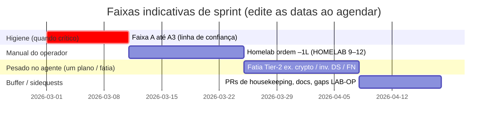

# Sprints, marcos e rastreabilidade leve de PM

**Finalidade:** Mapear a execução do [PLANS_TODO.md](PLANS_TODO.md) para **janelas de foco** no tamanho de sprint, **marcos** comemoráveis e visões opcionais **Gantt / Kanban**—mantendo-se **[consciente de tokens](TOKEN_AWARE_USAGE.md)** e reconhecendo que **recursos = você + agente** (não um PMO). Para **inventário completo** dos arquivos de plano e uma linha de intenção cada, veja **[PLANS_HUB.md](PLANS_HUB.md)** · [intro pt-BR](PLANS_HUB.pt_BR.md).

**English:** [SPRINTS_AND_MILESTONES.md](SPRINTS_AND_MILESTONES.md) — ao alterar temas, marcos ou o bloco SRE, alinhe **EN + pt-BR**.

**Política:** O [PLANS_TODO.md](PLANS_TODO.md) permanece **apenas em inglês** para histórico dos planos. Este **guia de sprint/SRE** é **bilíngue de propósito** (como docs voltados ao operador) para leitura em pt-BR quando o cansaço cognitivo for alto. O guia **não** substitui o `PLANS_TODO`; **agrega** a mesma ordem em **temas** com tempo delimitado. Após cada sprint (ou no meio), atualize o [painel de status](PLANS_TODO.md) com `python scripts/plans-stats.py --write` quando linhas de tabela mudarem; se criou ou arquivou um `PLAN_*.md`, rode também `python scripts/plans_hub_sync.py --write` para o [hub de planos](PLANS_HUB.md).

---

## 1. Relação com PMBOK / PRINCE2 (enxuto)

| Ideia (PM grande)                       | Aqui (2 pessoas, centrado no repositório)                                                                                                                                               |
| -----------------                       | ----------------------------------------                                                                                                                                                |
| **Termo de abertura / caso de negócio** | `README.md`, linha de status do `PLANS_TODO.md`, docs comerciais/licenciamento.                                                                                                         |
| **Estágios / fases**                    | **Higiene → Prova no lab → Fatias Tier-2 → Release** (ciclo). Sidequests (housekeeping, “rush” de homelab) são **pedidos de mudança**: entram no sprint atual ou num sprint **buffer**. |
| **Decomposição do trabalho**            | Arquivos de plano + tabelas `PLANS_TODO`; **uma linha ou fatia por sessão de agente** ao economizar tokens.                                                                             |
| **Papéis**                              | **Operador:** manual (Hub, hardware, estudo, jurídico, merges). **Agente:** código/docs/testes/checklists no repositório.                                                               |
| **Monitoramento**                       | Histórico Git, PRs, `plans-stats.py`, notas em `docs/releases/`, opcional GitHub Issues/Projects.                                                                                       |
| **Risco / qualidade**                   | Faixa prioritária **A1–A3** antes de rajadas de feature; `scripts/check-all.ps1`; homelab conforme [HOMELAB_VALIDATION.md](../ops/HOMELAB_VALIDATION.pt_BR.md).                         |

**Tolerância estilo PRINCE2:** Por sprint, defina **tempo** (ex.: 1–2 semanas), **escopo** (um tema primário + microcorreções opcionais) e **qualidade** (testes + docs atualizados no que for entregue). Se o escopo explodir, **divida** no sprint seguinte em vez de inflar o atual.

---

## 2. Visualização estilo Gantt (Mermaid)

GitHub (e muitos previews de Markdown) renderizam blocos **Mermaid** `gantt`. O gráfico abaixo usa **datas placeholder** só para **sequência relativa**—não é calendário comprometido. Ao planejar um sprint real, copie o bloco e ajuste as datas ao início do sprint, ou use Milestones do GitHub com vencimento.

**Legenda:** **O** = liderado pelo operador; **A** = pesado no agente; **M** = misto.

**Uso honesto:** mantenha **uma barra “primária” ativa** por semana civil; deixe o resto no **Backlog** (Kanban abaixo). **Sidequests** consomem a faixa **buffer** ou substituem a faixa de feature naquela semana—**explícito**.

---

## 3. Quadro estilo Kanban (espelho em Markdown)

Copie esta tabela para um board **GitHub Projects** ou doc pessoal; mova linhas editando a coluna **Status** a cada retro.

| Status           | Item                                                                              | Dono                                  | Fonte (ordem do plano / doc)                                                                                                                                                                                                                                 |
| ------           | ----                                                                              | ----                                  | ----------------------------                                                                                                                                                                                                                                 |
| **Backlog**      | Conectores de armazenamento de objetos (classe S3) — só plano por agora           | A/M                                   | [PLAN_OBJECT_STORAGE_CLOUD_CONNECTORS.md](PLAN_OBJECT_STORAGE_CLOUD_CONNECTORS.md)                                                                                                                                                                           |
| **Backlog**      | Triagem Dependabot / alertas                                                      | M                                     | `PLANS_TODO` –1, faixa A1 (cadência; **#195** fechou um burst—rever quando houver novos alertas)                                                                                                                                                               |
| **Backlog**      | Rebuild imagem no Hub + Scout                                                     | M                                     | –1b, A2 — após bumps de lockfile no `main`, rebuild/push para digest alinhar; depois Scout                                                                                                                                                                      |
| **Backlog**      | Higiene de tags no Hub                                                            | **Operador**                          | A3                                                                                                                                                                                                                                                           |
| **Backlog**      | Homelab §1+§2 (+ conector)                                                        | **Operador** (agente: lacunas em doc) | –1L, [HOMELAB_VALIDATION.md](../ops/HOMELAB_VALIDATION.pt_BR.md)                                                                                                                                                                                             |
| **Backlog**      | FN redução prioridades 5+                                                         | A/M                                   | [PLAN_ADDITIONAL_DETECTION…](PLAN_ADDITIONAL_DETECTION_TECHNIQUES_AND_FN_REDUCTION.md)                                                                                                                                                                       |
| **Backlog**      | Strong crypto Fase 1                                                              | A/M                                   | `PLANS_TODO` ordem 4                                                                                                                                                                                                                                         |
| **Backlog**      | Inventário de fontes de dados Fase 1                                              | A/M                                   | ordem 5                                                                                                                                                                                                                                                      |
| **Backlog**      | Notificações Fase 1                                                               | A/M                                   | ordem 6                                                                                                                                                                                                                                                      |
| **Backlog**      | Dashboard **responsivo mobile** (**M-MOBILE-V1**)                                 | A                                     | [PLAN_DASHBOARD_MOBILE_RESPONSIVE.md](PLAN_DASHBOARD_MOBILE_RESPONSIVE.md) — pode ir **antes** do **D-WEB** / i18n; retestar após locale ou **#86**                                                                                                        |
| **Backlog**      | **D-WEB** — desenho superfície web (i18n + #86 URLs/middleware)                   | A/M                                   | [PLAN_DASHBOARD_I18N.md](completed/PLAN_DASHBOARD_I18N.md) § marcos; [PLAN_DASHBOARD_REPORTS_ACCESS_CONTROL.md](PLAN_DASHBOARD_REPORTS_ACCESS_CONTROL.md) § sequência                                                                                                  |
| **Backlog**      | RBAC relatórios no dashboard — **implementação** (issue #86)                      | A/M                                   | Depois do **D-WEB**; mirar caminhos HTML **prefixados**; `[H2][U2]`                                                                                                                                                                                          |
| **Backlog**      | Locale dashboard **M-LOCALE-V1** (implementação)                                  | A                                     | **D-WEB** ✅; **antes** da **Fase 1** do **#86**; [PLAN_DASHBOARD_I18N.md](completed/PLAN_DASHBOARD_I18N.md)                                                                                                                                                            |
| **Backlog**      | **Site público + hub de docs** (**M-SITE-READY**) — profundidade **≠** pitch/PPTX | M                                     | [PLAN_WEBSITE_AND_DOCS_I18N_FUTURE.md](PLAN_WEBSITE_AND_DOCS_I18N_FUTURE.md) §2.1–2.3; guias técnicos/releases/roadmap com **frentes nomeadas** no **site**; deck para stakeholder permanece **raso** tecnicamente; i18n alinhado a **D-WEB** / **M-LOCALE** |
| **Selecionado**  | **S1 – Prova em lab** (–1L) + cluster HTTPS / Tier-2 quando for a hora             | M + **Operador** (SSH/hardware)       | [HOMELAB_VALIDATION.md](../ops/HOMELAB_VALIDATION.pt_BR.md) §1–§2+; depois ordens **4–7** em [PLANS_TODO](PLANS_TODO.md) conforme agenda                                                                                                                                 |
| **Em progresso** | *(um tema pesado no agente — ex.: fatia FN, HTTPS, ou CSS dashboard)*             | —                                     | Ver **Integration / WIP** em `PLANS_TODO`; manter um WIP salvo a menos que o operador divida o trabalho                                                                                                                                                          |
| **Bloqueado**    | *(aguardando operador: hardware, Hub, assessoria)*                                | **Operador**                          | Anotar bloqueio no PR ou runbook privado                                                                                                                                                                                                                     |
| **Feito**        | **S0 – Rajada de confiança** (–1 **#195**; –1b snapshot Scout; **S0b** backup/restore **DEPLOY §9**) | M + Op (A3 Hub)                       | **A3** higiene de tags ainda operador; **M-TRUST** em grande parte ok—ver Integration em `PLANS_TODO`                                                                                                                                                          |

**Limite WIP no Kanban:** **1** tema de feature primário em **Em progresso** nas sessões com agente; tarefas do **operador** (estudo, hardware de lab) podem **paralelizar** no calendário, mas evitem **dois** temas pesados no agente sem acordo explícito.

### 3.1 Faixa de estudo e certificação (calendário do operador)

- **Foco principal (2026):** **Cyber pago (CWL)** — concluir **BTF → C3SA** e sequência §3.2 em [PORTFOLIO_AND_EVIDENCE_SOURCES.md](PORTFOLIO_AND_EVIDENCE_SOURCES.md); **credibilidade** = **essas conclusões** + **Data Boar entregue** + narrativa de compliance. O editor neste repo pode usar **vários** modelos; **não** tratar estudo **só Anthropic** como faixa principal.
- **Ritmo semanal (sugestão):** **2** CWL + **1** IA; na semana seguinte **2** CWL + **1** outro assunto; repetir—ver PORTFOLIO §3.0 e [OPERATOR_MANUAL_ACTIONS.pt_BR.md](../ops/OPERATOR_MANUAL_ACTIONS.pt_BR.md) §1. Reduzir quando **faixa A** ou release apertar.
- **Alternando ao longo do ano:** **Anthropic Academy** (ou outros cursos de IA) quando couber no calendário — [Anthropic courses](https://docs.claude.com/en/docs/resources/courses); **CCA** = **capstone quando elegível**, sem prazo fixo.
- **Na mesma janela:** **fio fino** da **faixa prioritária A** — [PLANS_TODO.md](PLANS_TODO.md) **–1** / **–1b**.
- **Opcional:** certificados de conclusão **terceiros** (ex. Cursor no Coursera) — só polimento de CV.
- **Retakes:** Se **CCA** (ou outro) falhar, notas em `docs/private/` e **nova** tentativa depois.

---

## 4. Sprints recomendados (agregados, otimizados para token)

Sprints são **temas** de 1–2 semanas no relógio; dentro de cada um, ainda vale **uma fatia por sessão de agente** conforme [TOKEN_AWARE_USAGE.md](TOKEN_AWARE_USAGE.md). **Reordene** quando a faixa prioritária **A** estiver vermelha.

| Sprint                                | Tema                  | Resultados primários                                                                                                                                                      | Momentos do operador (seu calendário)                            | Sessões de agente (típico)                                           |
| ------                                | ----                  | --------------------                                                                                                                                                      | -------------------------------------                            | --------------------------                                           |
| **S0 – Rajada de confiança**          | Higiene               | A1–A3 (mín.), –1, –1b verdes ou documentados                                                                                                                              | GitHub Security, UI do Hub, aprovar/merge de PRs                 | `pyproject`/lock/export, notas Dockerfile/Scout, PRs pequenos de doc |
| **S0b – Operacionalidade (opcional)** | Fatia SRE             | Um item de **readiness**: ponteiro de runbook, nota de backup ou hook de KPI—ver §7 (SRE) e [PLAN_READINESS_AND_OPERATIONS.md](PLAN_READINESS_AND_OPERATIONS.md) §4.3–4.7 | Você valida passos num caminho real de deploy                    | Só PR curto de doc/script; sem plano de feature novo                 |
| **S1 – Prova no lab**                 | –1L                   | Baseline HOMELAB + ≥1 caminho de conector; nota datada em privado                                                                                                         | SSH, VMs, Docker no segundo host; evidência em `docs/private/`   | Corrigir lacunas do playbook, `docs/ops` só se achar contradição     |
| **S2 – Profundidade de detecção**     | FN / hints            | Uma ou duas linhas do plano FN (ex. 5, 6 ou 10–11)—**não todas**                                                                                                          | Revisar config em dado real se preciso                           | Implementação + testes + docs SENSITIVITY_DETECTION                  |
| **S3 – Inventário / crypto**          | Vertical Tier-2       | **Ou** Strong crypto F1 **ou** Data source F1 (um sprint)                                                                                                                 | Validar CLI/relatório em scan real                               | Schema, wiring, testes, docs EN+pt-BR                                |
| **S4 – Sinais para fora**             | Notificações          | Fase 1 webhook (ou primeiro canal) + docs                                                                                                                                 | Fornecer URL de webhook de teste; política de canal              | Formato de config, módulo, exemplos                                  |
| **S5 – Buffer / manutenção**          | Controle de sidequest | PRs de housekeeping, sync operator-help, limpeza de branch, notas LAB-OP privadas                                                                                         | Merges manuais, blocos de estudo para cert (calendário separado) | PRs pequenos doc/teste; sem plano grande novo                        |
| **S6+**                               | Repetir ou adiar      | Próxima linha em “What to start next” ou tier adiado                                                                                                                      | Conforme necessário                                              | Mesma disciplina de uma fatia                                        |

### 4.0 S0 e S0b — checklist de execução (quando for a hora)

**Intenção:** Rodar **S0 – Rajada de confiança** quando tiver **1–3 sessões focadas** (sem misturar com fatia grande de feature). Opcionalmente acrescentar **S0b – Operacionalidade** na **mesma semana civil** se houver energia—é **um PR pequeno de doc ou script**, não um segundo tema de feature.

#### S0 – Rajada de confiança (equivale ao mínimo de **M-TRUST**)

Executar **nessa ordem**, salvo quando só documentar exceções (mesmo assim atualizar *Integration / WIP* em [PLANS_TODO.md](PLANS_TODO.md) ao fechar).

| Passo | ID | Ação | Pronto quando |
| ----- | -- | ---- | -------------- |
| 1 | **–1 / A1** | [Dependabot](https://github.com/FabioLeitao/data-boar/security/dependabot) + PRs abertos: subir deps com segurança; **`uv lock`**, **`uv export --no-emit-package pyproject.toml -o requirements.txt`**, **`.\scripts\check-all.ps1`**, merge com CI verde. | Alertas triados; lockfile + `requirements.txt` alinhados; ver [SECURITY.pt_BR.md](../SECURITY.pt_BR.md) SLAs. |
| 2 | **–1b / A2** | **`docker scout quickview`** / **`docker scout recommendations`** em **`fabioleitao/data_boar:latest`** (imagem alinhada ao `main`); rebuild se base ou deps corrigirem CVEs. | Scan aceitável **ou** exceção de imagem base documentada—ver *Integration / WIP* no PLANS_TODO. |
| 3 | **A3** | Higiene de tags no **Docker Hub** (operador): remover ou documentar tags obsoletas; alinhar a [DEPLOY.pt_BR.md](../deploy/DEPLOY.pt_BR.md) §8. | Só tags suportadas; parceiros sem pin em tags mortas. |

**Opcional no mesmo sprint:** **`uvx pip-audit -r requirements.txt`** para rever [pygments](../ops/DEPENDABOT_PYGMENTS_CVE.md) / [pyOpenSSL + Snowflake](../ops/DEPENDABOT_PYOPENSSL_SNOWFLAKE.md).

**Marco:** **M-TRUST** (ver [§5 Marcos](#5-marcos-a-cada-alguns-sprints)) — registrar progresso na linha *plan status* do PLANS_TODO quando A1–A3 estiverem verdes ou documentados.

#### S0b – Operacionalidade (opcional; caminha para **M-OBS**)

Escolher **só um** item—token-aware; operador valida num deploy real.

| Escolha uma | Onde implementar | Pronto quando |
| ----------- | ---------------- | ------------- |
| **One-liner de runbook** | Estender [OBSERVABILITY_SRE.md](../OBSERVABILITY_SRE.pt_BR.md) ou [DEPLOY.pt_BR.md](../deploy/DEPLOY.pt_BR.md): se o app cair → checar **`GET /health`**, logs, `CONFIG_PATH`, disco/caminho SQLite, reinício; se o scan travar → … | Uma subseção curta; link no PLANS_TODO se útil. |
| **Nota backup / restore** | [USAGE.pt_BR.md](../USAGE.pt_BR.md) e/ou [DEPLOY.pt_BR.md](../deploy/DEPLOY.pt_BR.md): o que guardar (config, SQLite, dir de relatórios); como restaurar. | EN + pt-BR conforme política de docs. |
| **Gancho de KPI** | Rodar **`python scripts/kpi-export.py --limit-prs 10`**; colar ou arquivo em `docs/releases/` (ex. `kpi_snapshot.md`) ou linha na próxima release note. | Baseline do [PLAN_READINESS_AND_OPERATIONS.md](PLAN_READINESS_AND_OPERATIONS.md) §4.7 refletida no texto. |

**Estudo / certificações:** Trate como **swimlane paralela** (só operador). Blocos **fixos** (ex. 1–2×/semana) **depois** de uma fatia com agente naquele dia, sem misturar com código profundo—conforme `TOKEN_AWARE_USAGE.md` §3 e [PORTFOLIO_AND_EVIDENCE_SOURCES.md](PORTFOLIO_AND_EVIDENCE_SOURCES.md) §3.2.

**“Rush” de homelab:** Igual **S1** ou **S5**; se **interromper** S2–S4, **renomeie** o sprint para “Interrupção de lab” e **retome** o tema anterior no seguinte—preserva narrativa para retros.

### 4.1 Licenciamento (SKUs), ativação e acesso ao dashBOARd/API (ainda sem sprint numerado)

A tabela **S0–S6** **ainda não** tem linha dedicada para **assinatura permanente vs lab vs consultoria**, **reforço de ativação/bloqueio em runtime** ou **autenticação / RBAC** no **dashBOARd** e nas **APIs**. Hoje a **Fase 1** de licenciamento está no repositório ([`LICENSING_SPEC.md`](../LICENSING_SPEC.md): `open` / `enforced`, JWT, trial com watermark, revogação); claims de **parceiro / tier / consultoria** estão como **extensão futura** documentada—ver faixa prioritária **A** (A4 emissor privado, A7 jurídico) em [PLANS_TODO.md](PLANS_TODO.md).

#### Onde encaixar na linha do tempo

- **Não adie** até “depois de todo o Tier 2” se a UI/API for exposta além de **um operador de confiança** em loopback. Assim que **M-LAB** for crível e o objetivo for **assinatura paga** ou deploy em **rede compartilhada**, trate **M-ACCESS** (abaixo) como **tema de sprint**—em geral **um sprint focado** **entrelaçado com S2–S4** (ex.: após **S1** ou trocando com uma fatia Tier-2), **não** só em **S6+**.
- **Sequência recomendada (pragmática):** (1) **Jurídico + produto:** matriz de SKUs (assinatura permanente, trial, parceiro, lab/consultoria) → claims JWT e modelos no repositório **privado** do emissor—**antes** de cravar contratos. (2) **Endurecimento rápido:** documentar padrão com **reverse proxy** + **OIDC** (ex.: OAuth2 Proxy, Traefik, Caddy) para login estilo Microsoft/Google/Entra **sem** esperar auth completa dentro da app. (3) **Na aplicação:** chaves de API ou **Bearer** em rotas sensíveis; sessão ou token para o HTML/API do dashboard. (4) **RBAC:** papéis (ex.: leitor / operador / admin) ligados à identidade. (5) **Depois:** SSO de primeira classe, **TOTP**, **WebAuthn / passkeys** (passwordless, no espírito do fluxo com Authenticator no Office 365). **Bitwarden** (ou similar) casa melhor como **cofre de segredos** de deploy e credenciais de cliente—**não** costuma ser o IdP corporativo principal; alinhar com o IAM do cliente (Entra ID, Okta, etc.).

#### Identidade: OIDC na borda vs passwordless na app (mesmo roadmap, sem contradição)

- **Cliente já tem IdP:** o passo (2) desta seção—**reverse proxy + OIDC**—protege o dashboard **sem** exigir login completo dentro da app primeiro.
- **Médias / SSO imaturo:** [PLAN_DASHBOARD_REPORTS_ACCESS_CONTROL.md](PLAN_DASHBOARD_REPORTS_ACCESS_CONTROL.md) (**#86**) ordena **WebAuthn / passkeys** (ex.: **Bitwarden Passwordless.dev** como integração mínima) **antes** de **SSO** enterprise de primeira classe **dentro** do produto.
- **M-ACCESS** “pronto quando” fica atendido com **documentar e testar em smoke** **pelo menos um** padrão suportado (**só proxy**, **sessão na app** ou **ambos** em deploys de referência distintos).

- **Consultoria / lab:** separar **direito de uso** (o que o token permite: só consultoria, limite de linhas, watermark) de **quem acessa** o dashBOARd. Os dois fecham a narrativa comercial.

**Marco:** **M-ACCESS** (§5)—superfícies “prontas para assinatura” e caminho de identidade documentado.

#### Fatias priorizadas (controles de licenciamento + pacotes por tier)

| Prioridade | Fatia                                                                            | Saída esperada                                                                                                                                                             |
| ---        | ---                                                                              | ---                                                                                                                                                                        |
| P1         | Definir contrato de claims (`dbtier`, `dbfeatures`, opcional `dbextras_profile`) | Rascunho de esquema + exemplos de token em `LICENSING_SPEC`; sem bloqueio novo em runtime ainda.                                                                           |
| P2         | Matriz de gating em runtime                                                      | Tabela determinística de allow/deny: Standard vs Pro/Partner vs Enterprise para recursos opcionais (incluindo heurísticas futuras de IA e cloaking/content-type).          |
| P3         | Controles de kill switch                                                         | Caminho de desativação de emergência (claim e/ou overlay de revogação) documentado para operação/suporte.                                                                  |
| P4         | Política de perfis de dependência (`uv` extras)                                  | Fluxo de instalador/operação para perfis permitidos (`.[nosql]`, `.[datalake]`, etc.) por entitlement, com trilha de auditoria e sem mutação silenciosa durante varredura. |
| P5         | Transparência para operador/cliente                                              | Docs + mensagens explícitas em runtime + campos em relatório/auditoria mostrando quais controles de entitlement estão ativos.                                              |

### 4.2 Cluster da superfície web do dashboard (idioma **+** issue #86)

**Planos:** [PLAN_DASHBOARD_I18N.md](completed/PLAN_DASHBOARD_I18N.md), [PLAN_DASHBOARD_REPORTS_ACCESS_CONTROL.md](PLAN_DASHBOARD_REPORTS_ACCESS_CONTROL.md) e [PLAN_DASHBOARD_MOBILE_RESPONSIVE.md](PLAN_DASHBOARD_MOBILE_RESPONSIVE.md) (layout responsivo — **ortogonal** ao idioma). Mesmos arquivos (`api/routes.py`, templates, CSS/JS estático, middleware); **critérios de aceite distintos** (língua vs autorização vs viewport).

**Mobile dentro do cluster (opcional no calendário):** **M-MOBILE-V1** **não** depende do **D-WEB** — entregar CSS/HTML responsivo nas URLs atuais; quando **M-LOCALE-V1** ou **#86** mudarem caminhos, fazer **regressão mobile** curta.

| Ordem | Item                                  | Dono | Notas                                                                                                                                                                                             |
| ----- | ----                                  | ---- | -----                                                                                                                                                                                             |
| 0     | **M-MOBILE-V1** (opcional)            | A    | Nav + tabelas + gráfico responsivos — [PLAN_DASHBOARD_MOBILE_RESPONSIVE.md](PLAN_DASHBOARD_MOBILE_RESPONSIVE.md). **Antes** ou **em paralelo** ao trabalho de locale se priorizar telefone/tablet. |
| 1     | **D-WEB**                             | A/M  | ✅ **Feito** (matriz de rotas + middleware — [PLAN_DASHBOARD_REPORTS_ACCESS_CONTROL.md](PLAN_DASHBOARD_REPORTS_ACCESS_CONTROL.md) § Phase 0).                                                         |
| 2     | **M-LOCALE-V1**                       | A    | **Próxima fatia de código** neste cluster: prefixo de locale + JSON `en` / `pt-BR` + cookie / `Accept-Language` / fallback — [PLAN_DASHBOARD_I18N.md](completed/PLAN_DASHBOARD_I18N.md). **Antes** da linha 3. |
| 3     | **#86 Fase 1+**                       | A    | Sessão + passwordless (mínimo Bitwarden Passwordless.dev) nos **mesmos** caminhos `/{locale}/…` — **depois** de **M-LOCALE-V1**.                                                                 |

**Kanban:** coloque **D-WEB** em **Backlog** ou **Selecionado** ao agendar o passe de desenho; mantenha **um** tema pesado no agente em **Em progresso**, conforme [TOKEN_AWARE_USAGE.md](TOKEN_AWARE_USAGE.md).

### 4.3 Site público futuro (separação de conteúdo vs pitch) — **não ativo**

**Estado:** Só planejamento — **não** estamos construindo o site agora.

| Tópico                         | Nota                                                                                                                                                                                                               |
| ------                         | ----                                                                                                                                                                                                               |
| **Pitch / apresentação**       | Narrativa **curta** para stakeholder (ex. `docs/private/pitch/`); pouca **profundidade técnica**; só **marca** / metáfora.                                                                                         |
| **Compliance-legal no GitHub** | `COMPLIANCE_AND_LEGAL`, frameworks, licenciamento — profundidade de **governança**, não site HOWTO completo.                                                                                                       |
| **Site futuro**                | Camada **profunda**: USAGE, TECH_GUIDE, TESTING, Docker/deploy, cenários, amostras, **release notes**, **roadmap com frentes ativas nomeadas**, **Docker Hub** + **GitHub**; **sincronizado** com versões do repo. |
| **i18n**                       | **Mesmo padrão** de negociação de locale do **dashBOARd** ([PLAN_DASHBOARD_I18N.md](completed/PLAN_DASHBOARD_I18N.md), [PLAN_WEBSITE_AND_DOCS_I18N_FUTURE.md](PLAN_WEBSITE_AND_DOCS_I18N_FUTURE.md) §2.2).                   |
| **Cadência**                   | Nova geração de **deck EN+pt-BR** → **lembrar** de agendar revisão de **conteúdo/roadmap do site** para o público não ficar defasado.                                                                              |

---

## 5. Marcos (a cada poucos sprints)

Use **Milestones** do GitHub ou tags de release; abaixo, camada **semântica** alinhada ao que já foi entregue (ex. **1.6.5**).

| Marco               | Significado                                                           | “Pronto quando” (evidência)                                                                                                                                                                                                                                                                                                                                                                                                                                                                                                                                                                                                         |
| -----               | -----------                                                           | ----------------------------                                                                                                                                                                                                                                                                                                                                                                                                                                                                                                                                                                                                        |
| **M-TRUST**         | Artefatos públicos confiáveis                                         | A1–A3 atendidos; Dependabot/Scout documentados; política de imagem clara                                                                                                                                                                                                                                                                                                                                                                                                                                                                                                                                                            |
| **M-OBS**           | Baseline operacional (SRE)                                            | `/health` (e `/status` quando couber) documentados para **seu** caminho de deploy; frase opcional de SLO em doc de ops; **qualquer um** entre: runbook de uma linha, nota backup/restore, hook de export de KPI—conforme [OBSERVABILITY_SRE.md](../OBSERVABILITY_SRE.pt_BR.md) + [PLAN_READINESS_AND_OPERATIONS.md](PLAN_READINESS_AND_OPERATIONS.md) §4.3–4.7                                                                                                                                                                                                                                                                      |
| **M-LAB**           | Confiança em segundo ambiente                                         | [HOMELAB_VALIDATION.md](../ops/HOMELAB_VALIDATION.pt_BR.md) §12 + nota datada em privado                                                                                                                                                                                                                                                                                                                                                                                                                                                                                                                                            |
| **M-SCAN+**         | Fatia Tier-2 entregue                                                 | Um vertical liberado (crypto **ou** data source **ou** fatia FN maior) com testes + docs voltados ao usuário                                                                                                                                                                                                                                                                                                                                                                                                                                                                                                                        |
| **M-RICH**          | Data soup — rich media Tier 3                                         | **Em `main`:** legendas + metadados/OCR opcional + cloaking por magic bytes; `docs/releases/1.6.5.md` (ou patch escolhido); testes verdes — ver [PLANS_TODO.md](PLANS_TODO.md) **Integration / WIP** enquanto a branch estiver aberta                                                                                                                                                                                                                                                                                                                                                                                               |
| **M-NOTIFY**        | Consciência fora de banda                                             | Notificações F1 utilizáveis com config documentada                                                                                                                                                                                                                                                                                                                                                                                                                                                                                                                                                                                  |
| **M-ACCESS**        | Prontidão para pago / rede compartilhada (licenciamento + identidade) | **SKUs comerciais** pretendidos e caminho **enforced** testados; política de tiers + feature packs (incluindo kill switch) documentada; dashBOARd/API **sem uso anônimo** no deploy de referência—via **proxy+OIDC documentado** e/ou auth **na app**; RBAC ou história de papéis equivalente documentada em pelo menos um padrão                                                                                                                                                                                                                                                                                                   |
| **D-WEB**           | **Desenho** da superfície web do dashboard (i18n ∩ #86)               | Mapa de URLs + ordem do middleware **escritos** e com cross-links; **sem** código de produto obrigatório (diagrama + planos OK)                                                                                                                                                                                                                                                                                                                                                                                                                                                                                                     |
| **M-MOBILE-V1**     | Dashboard **usável em navegador de telefone**                         | Conforme [PLAN_DASHBOARD_MOBILE_RESPONSIVE.md](PLAN_DASHBOARD_MOBILE_RESPONSIVE.md): nav + relatórios + home + pass em config/help/about; **sem** mudança de prefixo de URL; docs + QA manual                                                                                                                                                                                                                                                                                                                                                                                                                                         |
| **M-LOCALE-V1**     | **Locale v1** do HTML do dashboard                                    | Conforme [PLAN_DASHBOARD_I18N.md](completed/PLAN_DASHBOARD_I18N.md): HTML prefixado, `en`+`pt-BR`, negociação, seletor, testes, paridade de chaves no CI                                                                                                                                                                                                                                                                                                                                                                                                                                                                                      |
| **M-SITE-READY**    | **Primeiro site público + hub técnico de documentação** (fatia GTM)   | Site **no ar** (estático/marketing) com: (1) páginas de **história não técnicas** (alinhadas ao **pitch** para stakeholder, sem “dump” do TECH_GUIDE); (2) **hub técnico** — links profundos ou caminhos **alinhados à versão** para USAGE, TECH_GUIDE, TESTING, deploy/Docker, cenários, entrada em compliance-samples, **release notes**, **Docker Hub** + **GitHub**; (3) **roadmap** com **frentes ativas específicas**; (4) **locale** **consistente** com o plano i18n do dashBOARd (prefixo / cookie / `Accept-Language` / JSON). Ver [PLAN_WEBSITE_AND_DOCS_I18N_FUTURE.md](PLAN_WEBSITE_AND_DOCS_I18N_FUTURE.md) §2.1–2.3. |
| **M-RELEASE x.y.z** | Corte versionado do produto                                           | Checklist VERSIONING existente + `docs/releases/x.y.z.md` + tags no Hub                                                                                                                                                                                                                                                                                                                                                                                                                                                                                                                                                             |

**Cadência sugerida:** **M-TRUST** antes de rajada grande de feature; **M-OBS** pode vir no mesmo sprint ou no seguinte a **M-TRUST** (docs/automação pequena); **M-LAB** antes de narrativa para cliente/demo; **M-RICH** quando o PR de rich media entrar em `main`; **M-ACCESS** antes de prometer **assinatura permanente** ou **multiusuário** em host alcançável; **M-SITE-READY** quando **publicarem de propósito** a superfície marketing/docs (faz sentido depois de **M-LOCALE-V1** se quiserem UX de idioma coerente); **M-RELEASE** quando VERSIONING mandar publicar.

### Compor marcos (mapa de ciclo de vida)

Use **IDs de marcos** (família **M-**: **M-TRUST**, **M-LAB**, …) e [VERSIONING](../releases/) para strings semver em tags. **Não** trate esta subseção como nome alternativo de estágio do produto: sufixos como **beta** ou **rc** ainda podem aparecer como **pré-release** em versões, conforme política—aqui só descrevemos **quais combinações de marcos** costumam alinhar a uma postura de **narrativa**, **endurecimento**, **comercial** ou **automação**.

| Estágio (narrativa) | Pacote típico de marcos | Ponteiros |
| ------------------- | ----------------------- | --------- |
| **Narrativa para stakeholder / segundo ambiente** | **M-LAB** (mínimo); opcional **M-RICH**, **M-SCAN+** | Ordem **–1L** no [PLANS_TODO.md](PLANS_TODO.md); evidência em [HOMELAB_VALIDATION.md](../ops/HOMELAB_VALIDATION.pt_BR.md) + nota datada em privado. |
| **Confiança + operação (baseline)** | **M-TRUST**; **M-OBS** (pelo menos um item S0b) | Antes de rajadas grandes de feature; runbook / backup / cadência de KPI em [PLAN_READINESS_AND_OPERATIONS.md](PLAN_READINESS_AND_OPERATIONS.md). |
| **Postura de rede compartilhada / pago** | **M-ACCESS** | Licenciamento + identidade; §4.1 aqui + [PLAN_DASHBOARD_REPORTS_ACCESS_CONTROL.md](PLAN_DASHBOARD_REPORTS_ACCESS_CONTROL.md). |
| **Operação pronta para automação (stretch)** | **M-OBS** “completo” (runbook + backup + hábito de KPI); **M-NOTIFY**; ganchos opcionais em [PLAN_READINESS_AND_OPERATIONS.md](PLAN_READINESS_AND_OPERATIONS.md) §4.7 | Reduz toil; **não** é obrigatório para todo **M-RELEASE**. |

**Cluster dashboard / idioma** (**D-WEB**, **M-LOCALE-V1**, **#86**) é **ortogonal** às linhas acima—agende conforme §4.2 quando promover o tema.

**Cadeia de suprimentos (PyPI + GitHub Actions):** lockfile versionado, **`pip-audit`** na CI, **Dependabot** (pip + actions), Actions **fixadas em SHA** nos workflows principais — bullet *Integration / WIP* em **PLANS_TODO**; detalhes em [WORKFLOW_DEFERRED_FOLLOWUPS.pt_BR.md](../ops/WORKFLOW_DEFERRED_FOLLOWUPS.pt_BR.md); artefatos **SBOM:** [ADR 0003](../adr/0003-sbom-roadmap-cyclonedx-then-syft.md).

---

## 5.1 Quando abrir um PR (gate rápido)

| Situação                                            | Abrir PR?                | Versão                                                                         |
| --------                                            | ---------                | ------                                                                         |
| Feature + testes + doc prontos; **`main` ok no CI** | **Sim** — um tema por PR | Bump no mesmo PR ou no seguinte, conforme hábito em [VERSIONING](../releases/) |
| Só typo / markdown em `docs/`                       | Sim — PR pequeno         | Muitas vezes **sem** bump; **patch** opcional se etiquetar no Hub              |
| Branch mistura temas **não relacionados**           | **Dividir** antes do PR  | Revisão e release notes mais limpas                                            |
| Dependência / segurança                             | Sim — urgente            | **Patch** + export do lockfile                                                 |

**Após merge:** checklist de release (tabela **1.6.5** em [PLANS_TODO.md](PLANS_TODO.md)); **patch** para recursos opcionais aditivos; **minor** para pacote “marketing” ou mudança incompatível.

---

## 6. Dentro do sprint: sequência (consciente de token)

1. **Início do sprint (15 min):** Escolha **uma** linha primária em [PLANS_TODO.md](PLANS_TODO.md) “What to start next” (ou faixa A se crítico). Registre no Kanban **Selecionado** ou na descrição do Milestone no GitHub.
1. **Cada sessão com agente:** Uma **fatia** + testes + toque em doc; rode `.\scripts\check-all.ps1` ou `uv run pytest` conforme política do repositório.
1. **Operador em async:** Passos de lab, Hub, estudo—**sem** expectativa de o agente “fazer o lab” por você.
1. **Fim do sprint (retro, 15 min):** Atualize `PLANS_TODO` / tabelas do plano; rode `python scripts/plans-stats.py --write`; anote **sidequests** e **bloqueios** para o tema do próximo sprint. Opcional: **uma lição aprendida** (bullet) ou linha **blameless** “o que quebrou / o que mudamos”—ver §7.3.
1. **Higiene Git:** Garantir **commits locais** registrando o progresso no sprint (unidades significativas ou lotes temáticos)—evitar um diff **gigante não commitado** antes do próximo PR ou release; ver [COMMIT_AND_PR.pt_BR.md](../ops/COMMIT_AND_PR.pt_BR.md) ([EN](../ops/COMMIT_AND_PR.md)) e **`.cursor/rules/execution-priority-and-pr-batching.mdc`**.

---

## 7. SRE / confiabilidade, segurança e governança (multidisciplinar, escala 2 pessoas)

Amarra **planos + PM + fluxo de trabalho + runtime** a práticas de SRE e plataforma—**reduzidas** para cortar **caos, vulnerabilidades, trabalho solto e retrabalho** sem burocracia de enterprise.

### 7.1 Mitigação de toil e automação

| Toil (repetitivo, manual)       | Prefira                                                                                     |
| -------------------------       | -------                                                                                     |
| “Rodamos lint + testes?”        | `scripts/check-all.ps1` (ou `pre-commit` + `pytest`) antes de commit/PR.                    |
| Deriva de dependência / alertas | Faixa **A1**; lockfile + export `requirements.txt` no mesmo PR que mudanças em `pyproject`. |
| Higiene de imagem               | **A2/A3**, fluxos `scripts/docker-hub-publish.ps1` / README docker—evite tags ad hoc.       |
| “O que ainda está aberto?”      | `gh pr list --state open`; guarda de PRs pendentes no **AGENTS.md** nas bordas da sessão.   |
| Manutenção das tabelas de plano | `python scripts/plans-stats.py --write` quando status de linhas mudar.                      |

**Regra:** Se você faz **duas vezes** manualmente os mesmos passos, **abra uma fatia** para scriptar ou documentar (consciente de token: uma fatia).

### 7.2 SLI, SLO, SLA e orçamento de erros (leve)

- **SLI** = o que medimos (ex. taxa de 200 no health check, taxa de conclusão de scan). **SLO** = meta interna (ex. 99,9% checks OK). **SLA** = o que você **promete** a terceiros (clientes/parceiros)—muitas vezes mais estrito ou mais simples que SLOs internos.
- **Orçamento de erros:** Quando **M-TRUST** está vermelho (Dependabot/Scout/alertas sem tratamento), trate **trabalho de feature** como dívida contra confiabilidade—**gaste o orçamento** em A1–A3 primeiro, como no burst “security-first” do [TOKEN_AWARE_USAGE.md](TOKEN_AWARE_USAGE.md).
- **Detalhe e ganchos da app:** [OBSERVABILITY_SRE.md](../OBSERVABILITY_SRE.pt_BR.md) (`/health`, `/status`, métricas opcionais, política de logs).

### 7.3 Postmortem blameless, RCA e lições aprendidas

Use para **incidentes de produção** *e* para **falhas de processo** (release ruim, merge errado, branch perdida, “esquecemos operator-help sync”).

- **Blameless:** Foco em **sistemas e checagens**, não em culpa; o time é você + agente + ferramentas.
- **RCA (causa raiz):** Pergunte **por quê** até achar uma **barreira corrigível** (ex. “nenhum PR sem check-all”, “mergear `main` antes de branch longa de doc”).
- **Saída:** 3–5 linhas: linha do tempo, causa raiz, **ações** (doc, script, regra de CI). Guarde em `docs/private/` para ops sensível ou um subtópico **retro** nas notas do sprint.

### 7.4 DevSecOps, cibersegurança, compliance e governança

| Área                        | Neste repositório                                                                                                                                                  |
| ----                        | -----------------                                                                                                                                                  |
| **DevSecOps**               | Shift-left: testes, Ruff, pip-audit/CodeQL, política de secrets—ver [OBSERVABILITY_SRE.md](../OBSERVABILITY_SRE.pt_BR.md) §3, [SECURITY.md](../SECURITY.md).       |
| **Governança**              | Verdade de execução única no **PLANS_TODO**; limites comercial/licenciamento em docs dedicados; sem secrets em arquivos rastreados ([AGENTS.md](../../AGENTS.md)). |
| **Narrativa de compliance** | A ferramenta apoia **evidência** de auditoria; retenção e processo são seus—[PLAN_READINESS_AND_OPERATIONS.md](PLAN_READINESS_AND_OPERATIONS.md) §4.4.             |

### 7.5 Trabalho solto (dangling) e prevenção de retrabalho

- **Branches / PRs:** Um PR coerente por tema; faça merge ou **feche como superseded** com ponteiro (evite cinco PRs de doc parados).
- **Docs vs código:** Após mudanças de CLI/API, agende **operator-help sync** ([OPERATOR_HELP_AUDIT.md](../OPERATOR_HELP_AUDIT.md); doc apenas EN) no **S5** ou no mesmo sprint da feature.
- **Configuração:** Exemplos no repositório; **secrets** só em env/privado—nunca `git add -f` com config real.

### 7.6 Instrumentação e observabilidade (aplicação)

- **Hoje:** Liveness via **`GET /health`**; visibilidade de scan via **`GET /status`**; métricas estruturadas opcionais—ver [OBSERVABILITY_SRE.md](../OBSERVABILITY_SRE.pt_BR.md), healthchecks em [DEPLOY.md](../deploy/DEPLOY.pt_BR.md).
- **Notificações (ordem 6):** O **S4** futuro melhora **observabilidade de resultados** (scan terminou, falhas) para operadores—complementa métricas.

---

## 8. Ferramentas opcionais (além de Markdown)

- **GitHub Projects:** Colunas = status do Kanban acima; issues = fatias (link para âncoras do plano).
- **Mermaid em descrições de PR:** Cole o mesmo bloco `gantt` para o timeline **daquele** release.
- **Export:** Se precisar de ferramenta PM clássica, exporte **CSV** das tabelas do `PLANS_TODO` manualmente ou por script a partir de padrões de `plans-stats.py`—mantenha o **repositório** como fonte da verdade.

---

## Ver também

- [PLANS_TODO.md](PLANS_TODO.md) — ordem de execução e painel
- [TOKEN_AWARE_USAGE.md](TOKEN_AWARE_USAGE.md) — sessões de uma fatia, faixa de estudo, faixa A
- [SPRINTS_AND_MILESTONES.md](SPRINTS_AND_MILESTONES.md) — esta visão em inglês (manter em sincronia)
- [OBSERVABILITY_SRE.pt_BR.md](../OBSERVABILITY_SRE.pt_BR.md) — SLI/SLO/SLA, endpoints de saúde, alinhamento DevSecOps
- [PLAN_READINESS_AND_OPERATIONS.md](PLAN_READINESS_AND_OPERATIONS.md) — runbooks, KPI, checklist de onboarding
- [CODE_PROTECTION_OPERATOR_PLAYBOOK.md](../CODE_PROTECTION_OPERATOR_PLAYBOOK.md) — prompts de burst segurança/IP
- [HOMELAB_VALIDATION.pt_BR.md](../ops/HOMELAB_VALIDATION.pt_BR.md) — critérios de conclusão do lab
