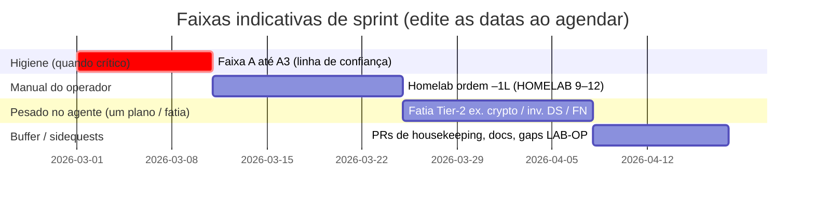

# Sprints, marcos e rastreabilidade leve de PM

**Finalidade:** Mapear a execução do [PLANS_TODO.md](PLANS_TODO.md) para **janelas de foco** no tamanho de sprint, **marcos** comemoráveis e visões opcionais **Gantt / Kanban**—mantendo-se **[consciente de tokens](TOKEN_AWARE_USAGE.md)** e reconhecendo que **recursos = você + agente** (não um PMO).

**English:** [SPRINTS_AND_MILESTONES.md](SPRINTS_AND_MILESTONES.md) — ao alterar temas, marcos ou o bloco SRE, alinhe **EN + pt-BR**.

**Política:** O [PLANS_TODO.md](PLANS_TODO.md) permanece **apenas em inglês** para histórico dos planos. Este **guia de sprint/SRE** é **bilíngue de propósito** (como docs voltados ao operador) para leitura em pt-BR quando o cansaço cognitivo for alto. O guia **não** substitui o `PLANS_TODO`; **agrega** a mesma ordem em **temas** com tempo delimitado. Após cada sprint (ou no meio), atualize o [painel de status](PLANS_TODO.md) com `python scripts/plans-stats.py --write` quando linhas de tabela mudarem.

---

## 1. Relação com PMBOK / PRINCE2 (enxuto)

| Ideia (PM grande) | Aqui (2 pessoas, centrado no repositório) |
| ----------------- | ---------------------------------------- |
| **Termo de abertura / caso de negócio** | `README.md`, linha de status do `PLANS_TODO.md`, docs comerciais/licenciamento. |
| **Estágios / fases** | **Higiene → Prova no lab → Fatias Tier-2 → Release** (ciclo). Sidequests (housekeeping, “rush” de homelab) são **pedidos de mudança**: entram no sprint atual ou num sprint **buffer**. |
| **Decomposição do trabalho** | Arquivos de plano + tabelas `PLANS_TODO`; **uma linha ou fatia por sessão de agente** ao economizar tokens. |
| **Papéis** | **Operador:** manual (Hub, hardware, estudo, jurídico, merges). **Agente:** código/docs/testes/checklists no repositório. |
| **Monitoramento** | Histórico Git, PRs, `plans-stats.py`, notas em `docs/releases/`, opcional GitHub Issues/Projects. |
| **Risco / qualidade** | Faixa prioritária **A1–A3** antes de rajadas de feature; `scripts/check-all.ps1`; homelab conforme [HOMELAB_VALIDATION.md](../ops/HOMELAB_VALIDATION.pt_BR.md). |

**Tolerância estilo PRINCE2:** Por sprint, defina **tempo** (ex.: 1–2 semanas), **escopo** (um tema primário + microcorreções opcionais) e **qualidade** (testes + docs atualizados no que for entregue). Se o escopo explodir, **divida** no sprint seguinte em vez de inflar o atual.

---

## 2. Visualização estilo Gantt (Mermaid)

GitHub (e muitos previews de Markdown) renderizam blocos **Mermaid** `gantt`. O gráfico abaixo usa **datas placeholder** só para **sequência relativa**—não é calendário comprometido. Ao planejar um sprint real, copie o bloco e ajuste as datas ao início do sprint, ou use Milestones do GitHub com vencimento.

**Legenda:** **O** = liderado pelo operador; **A** = pesado no agente; **M** = misto.

**Uso honesto:** mantenha **uma barra “primária” ativa** por semana civil; deixe o resto no **Backlog** (Kanban abaixo). **Sidequests** consomem a faixa **buffer** ou substituem a faixa de feature naquela semana—**explícito**.

---

## 3. Quadro estilo Kanban (espelho em Markdown)

Copie esta tabela para um board **GitHub Projects** ou doc pessoal; mova linhas editando a coluna **Status** a cada retro.

| Status | Item | Dono | Fonte (ordem do plano / doc) |
| ------ | ---- | ---- | ---------------------------- |
| **Backlog** | Triagem Dependabot / alertas | M | `PLANS_TODO` –1, faixa A1 |
| **Backlog** | Docker Scout + rebuild de imagem | M | –1b, A2 |
| **Backlog** | Higiene de tags no Hub | **Operador** | A3 |
| **Backlog** | Homelab §1+§2 (+ conector) | **Operador** (agente: lacunas em doc) | –1L, [HOMELAB_VALIDATION.md](../ops/HOMELAB_VALIDATION.pt_BR.md) |
| **Backlog** | FN redução prioridades 5+ | A/M | [PLAN_ADDITIONAL_DETECTION…](PLAN_ADDITIONAL_DETECTION_TECHNIQUES_AND_FN_REDUCTION.md) |
| **Backlog** | Strong crypto Fase 1 | A/M | `PLANS_TODO` ordem 4 |
| **Backlog** | Inventário de fontes de dados Fase 1 | A/M | ordem 5 |
| **Backlog** | Notificações Fase 1 | A/M | ordem 6 |
| **Selecionado** | *(uma linha só por semana consciente de tokens)* | — | Escolher em “What to start next” |
| **Em progresso** | *(escopo da sessão atual)* | — | Igual ao TOKEN_AWARE: “um plano ou uma fatia” |
| **Bloqueado** | *(aguardando operador: hardware, Hub, assessoria)* | **Operador** | Anotar bloqueio no PR ou runbook privado |
| **Feito** | *(entregue + testes + doc marcada)* | — | Atualizar `PLANS_TODO` + arquivo do plano |

**Limite WIP no Kanban:** **1** tema de feature primário em **Em progresso** nas sessões com agente; tarefas do **operador** (estudo, hardware de lab) podem **paralelizar** no calendário, mas evitem **dois** temas pesados no agente sem acordo explícito.

---

## 4. Sprints recomendados (agregados, otimizados para token)

Sprints são **temas** de 1–2 semanas no relógio; dentro de cada um, ainda vale **uma fatia por sessão de agente** conforme [TOKEN_AWARE_USAGE.md](TOKEN_AWARE_USAGE.md). **Reordene** quando a faixa prioritária **A** estiver vermelha.

| Sprint | Tema | Resultados primários | Momentos do operador (seu calendário) | Sessões de agente (típico) |
| ------ | ---- | -------------------- | ------------------------------------- | -------------------------- |
| **S0 – Rajada de confiança** | Higiene | A1–A3 (mín.), –1, –1b verdes ou documentados | GitHub Security, UI do Hub, aprovar/merge de PRs | `pyproject`/lock/export, notas Dockerfile/Scout, PRs pequenos de doc |
| **S0b – Operacionalidade (opcional)** | Fatia SRE | Um item de **readiness**: ponteiro de runbook, nota de backup ou hook de KPI—ver §7 (SRE) e [PLAN_READINESS_AND_OPERATIONS.md](PLAN_READINESS_AND_OPERATIONS.md) §4.3–4.7 | Você valida passos num caminho real de deploy | Só PR curto de doc/script; sem plano de feature novo |
| **S1 – Prova no lab** | –1L | Baseline HOMELAB + ≥1 caminho de conector; nota datada em privado | SSH, VMs, Docker no segundo host; evidência em `docs/private/` | Corrigir lacunas do playbook, `docs/ops` só se achar contradição |
| **S2 – Profundidade de detecção** | FN / hints | Uma ou duas linhas do plano FN (ex. 5, 6 ou 10–11)—**não todas** | Revisar config em dado real se preciso | Implementação + testes + docs SENSITIVITY_DETECTION |
| **S3 – Inventário / crypto** | Vertical Tier-2 | **Ou** Strong crypto F1 **ou** Data source F1 (um sprint) | Validar CLI/relatório em scan real | Schema, wiring, testes, docs EN+pt-BR |
| **S4 – Sinais para fora** | Notificações | Fase 1 webhook (ou primeiro canal) + docs | Fornecer URL de webhook de teste; política de canal | Formato de config, módulo, exemplos |
| **S5 – Buffer / manutenção** | Controle de sidequest | PRs de housekeeping, sync operator-help, limpeza de branch, notas LAB-OP privadas | Merges manuais, blocos de estudo para cert (calendário separado) | PRs pequenos doc/teste; sem plano grande novo |
| **S6+** | Repetir ou adiar | Próxima linha em “What to start next” ou tier adiado | Conforme necessário | Mesma disciplina de uma fatia |

**Estudo / certificações:** Trate como **swimlane paralela** (só operador). Blocos **fixos** (ex. 1–2×/semana) **depois** de uma fatia com agente naquele dia, sem misturar com código profundo—conforme `TOKEN_AWARE_USAGE.md` §3 e [PORTFOLIO_AND_EVIDENCE_SOURCES.md](PORTFOLIO_AND_EVIDENCE_SOURCES.md) §3.2.

**“Rush” de homelab:** Igual **S1** ou **S5**; se **interromper** S2–S4, **renomeie** o sprint para “Interrupção de lab” e **retome** o tema anterior no seguinte—preserva narrativa para retros.

### 4.1 Licenciamento (SKUs), ativação e acesso ao dashBOARd/API (ainda sem sprint numerado)

A tabela **S0–S6** **ainda não** tem linha dedicada para **subscrição permanente vs lab vs consultoria**, **reforço de ativação/bloqueio em runtime** ou **autenticação / RBAC** no **dashBOARd** e nas **APIs**. Hoje a **Fase 1** de licenciamento está no repositório ([`LICENSING_SPEC.md`](../LICENSING_SPEC.md): `open` / `enforced`, JWT, trial com watermark, revogação); claims de **parceiro / tier / consultoria** estão como **extensão futura** documentada—ver faixa prioritária **A** (A4 emissor privado, A7 jurídico) em [PLANS_TODO.md](PLANS_TODO.md).

#### Onde encaixar na linha do tempo

- **Não adie** até “depois de todo o Tier 2” se a UI/API for exposta além de **um operador de confiança** em loopback. Assim que **M-LAB** for crível e o objetivo for **subscrição paga** ou deploy em **rede compartilhada**, trate **M-ACCESS** (abaixo) como **tema de sprint**—em geral **um sprint focado** **entrelaçado com S2–S4** (ex.: após **S1** ou trocando com uma fatia Tier-2), **não** só em **S6+**.
- **Sequência recomendada (pragmática):** (1) **Jurídico + produto:** matriz de SKUs (subscrição permanente, trial, parceiro, lab/consultoria) → claims JWT e modelos no repositório **privado** do emissor—**antes** de cravar contratos. (2) **Endurecimento rápido:** documentar padrão com **reverse proxy** + **OIDC** (ex.: OAuth2 Proxy, Traefik, Caddy) para login estilo Microsoft/Google/Entra **sem** esperar auth completa dentro da app. (3) **Na aplicação:** chaves de API ou **Bearer** em rotas sensíveis; sessão ou token para o HTML/API do dashboard. (4) **RBAC:** papéis (ex.: leitor / operador / admin) ligados à identidade. (5) **Depois:** SSO de primeira classe, **TOTP**, **WebAuthn / passkeys** (passwordless, no espírito do fluxo com Authenticator no Office 365). **Bitwarden** (ou similar) casa melhor como **cofre de segredos** de deploy e credenciais de cliente—**não** costuma ser o IdP corporativo principal; alinhar com o IAM do cliente (Entra ID, Okta, etc.).
- **Consultoria / lab:** separar **direito de uso** (o que o token permite: só consultoria, limite de linhas, watermark) de **quem acessa** o dashBOARd. Os dois fecham a narrativa comercial.

**Marco:** **M-ACCESS** (§5)—superfícies “prontas para assinatura” e caminho de identidade documentado.

---

## 5. Marcos (a cada poucos sprints)

Use **Milestones** do GitHub ou tags de release; abaixo, camada **semântica** alinhada ao que já foi entregue (ex. **1.6.4**).

| Marco | Significado | “Pronto quando” (evidência) |
| ----- | ----------- | ---------------------------- |
| **M-TRUST** | Artefatos públicos confiáveis | A1–A3 atendidos; Dependabot/Scout documentados; política de imagem clara |
| **M-OBS** | Baseline operacional (SRE) | `/health` (e `/status` quando couber) documentados para **seu** caminho de deploy; frase opcional de SLO em doc de ops; **qualquer um** entre: runbook de uma linha, nota backup/restore, hook de export de KPI—conforme [OBSERVABILITY_SRE.md](../OBSERVABILITY_SRE.pt_BR.md) + [PLAN_READINESS_AND_OPERATIONS.md](PLAN_READINESS_AND_OPERATIONS.md) §4.3–4.7 |
| **M-LAB** | Confiança em segundo ambiente | [HOMELAB_VALIDATION.md](../ops/HOMELAB_VALIDATION.pt_BR.md) §12 + nota datada em privado |
| **M-SCAN+** | Fatia Tier-2 entregue | Um vertical liberado (crypto **ou** data source **ou** fatia FN maior) com testes + docs voltados ao usuário |
| **M-NOTIFY** | Consciência fora de banda | Notificações F1 utilizáveis com config documentada |
| **M-ACCESS** | Prontidão para pago / rede compartilhada (licenciamento + identidade) | **SKUs comerciais** pretendidos e caminho **enforced** testados; dashBOARd/API **sem uso anônimo** no deploy de referência—via **proxy+OIDC documentado** e/ou auth **na app**; RBAC ou história de papéis equivalente documentada em pelo menos um padrão |
| **M-RELEASE x.y.z** | Corte versionado do produto | Checklist VERSIONING existente + `docs/releases/x.y.z.md` + tags no Hub |

**Cadência sugerida:** **M-TRUST** antes de rajada grande de feature; **M-OBS** pode vir no mesmo sprint ou no seguinte a **M-TRUST** (docs/automação pequena); **M-LAB** antes de narrativa para cliente/demo; **M-ACCESS** antes de prometer **subscrição permanente** ou **multiusuário** em host alcançável; **M-RELEASE** quando VERSIONING mandar publicar.

---

## 6. Dentro do sprint: sequência (consciente de token)

1. **Início do sprint (15 min):** Escolha **uma** linha primária em [PLANS_TODO.md](PLANS_TODO.md) “What to start next” (ou faixa A se crítico). Registre no Kanban **Selecionado** ou na descrição do Milestone no GitHub.
2. **Cada sessão com agente:** Uma **fatia** + testes + toque em doc; rode `.\scripts\check-all.ps1` ou `uv run pytest` conforme política do repositório.
3. **Operador em async:** Passos de lab, Hub, estudo—**sem** expectativa de o agente “fazer o lab” por você.
4. **Fim do sprint (retro, 15 min):** Atualize `PLANS_TODO` / tabelas do plano; rode `python scripts/plans-stats.py --write`; anote **sidequests** e **bloqueios** para o tema do próximo sprint. Opcional: **uma lição aprendida** (bullet) ou linha **blameless** “o que quebrou / o que mudamos”—ver §7.3.
5. **Higiene Git:** Garantir **commits locais** registrando o progresso no sprint (unidades significativas ou lotes temáticos)—evitar um diff **gigante não commitado** antes do próximo PR ou release; ver [COMMIT_AND_PR.pt_BR.md](../ops/COMMIT_AND_PR.pt_BR.md) ([EN](../ops/COMMIT_AND_PR.md)) e **`.cursor/rules/execution-priority-and-pr-batching.mdc`**.

---

## 7. SRE / confiabilidade, segurança e governança (multidisciplinar, escala 2 pessoas)

Amarra **planos + PM + fluxo de trabalho + runtime** a práticas de SRE e plataforma—**reduzidas** para cortar **caos, vulnerabilidades, trabalho solto e retrabalho** sem burocracia de enterprise.

### 7.1 Mitigação de toil e automação

| Toil (repetitivo, manual) | Prefira |
| ------------------------- | ------- |
| “Rodamos lint + testes?” | `scripts/check-all.ps1` (ou `pre-commit` + `pytest`) antes de commit/PR. |
| Deriva de dependência / alertas | Faixa **A1**; lockfile + export `requirements.txt` no mesmo PR que mudanças em `pyproject`. |
| Higiene de imagem | **A2/A3**, fluxos `scripts/docker-hub-publish.ps1` / README docker—evite tags ad hoc. |
| “O que ainda está aberto?” | `gh pr list --state open`; guarda de PRs pendentes no **AGENTS.md** nas bordas da sessão. |
| Manutenção das tabelas de plano | `python scripts/plans-stats.py --write` quando status de linhas mudar. |

**Regra:** Se você faz **duas vezes** manualmente os mesmos passos, **abra uma fatia** para scriptar ou documentar (consciente de token: uma fatia).

### 7.2 SLI, SLO, SLA e orçamento de erros (leve)

- **SLI** = o que medimos (ex. taxa de 200 no health check, taxa de conclusão de scan). **SLO** = meta interna (ex. 99,9% checks OK). **SLA** = o que você **promete** a terceiros (clientes/parceiros)—muitas vezes mais estrito ou mais simples que SLOs internos.
- **Orçamento de erros:** Quando **M-TRUST** está vermelho (Dependabot/Scout/alertas sem tratamento), trate **trabalho de feature** como dívida contra confiabilidade—**gaste o orçamento** em A1–A3 primeiro, como no burst “security-first” do [TOKEN_AWARE_USAGE.md](TOKEN_AWARE_USAGE.md).
- **Detalhe e ganchos da app:** [OBSERVABILITY_SRE.md](../OBSERVABILITY_SRE.pt_BR.md) (`/health`, `/status`, métricas opcionais, política de logs).

### 7.3 Postmortem blameless, RCA e lições aprendidas

Use para **incidentes de produção** *e* para **falhas de processo** (release ruim, merge errado, branch perdida, “esquecemos operator-help sync”).

- **Blameless:** Foco em **sistemas e checagens**, não em culpa; o time é você + agente + ferramentas.
- **RCA (causa raiz):** Pergunte **por quê** até achar uma **barreira corrigível** (ex. “nenhum PR sem check-all”, “mergear `main` antes de branch longa de doc”).
- **Saída:** 3–5 linhas: linha do tempo, causa raiz, **ações** (doc, script, regra de CI). Guarde em `docs/private/` para ops sensível ou um subtópico **retro** nas notas do sprint.

### 7.4 DevSecOps, cibersegurança, compliance e governança

| Área | Neste repositório |
| ---- | ----------------- |
| **DevSecOps** | Shift-left: testes, Ruff, pip-audit/CodeQL, política de secrets—ver [OBSERVABILITY_SRE.md](../OBSERVABILITY_SRE.pt_BR.md) §3, [SECURITY.md](../SECURITY.md). |
| **Governança** | Verdade de execução única no **PLANS_TODO**; limites comercial/licenciamento em docs dedicados; sem secrets em arquivos rastreados ([AGENTS.md](../../AGENTS.md)). |
| **Narrativa de compliance** | A ferramenta apoia **evidência** de auditoria; retenção e processo são seus—[PLAN_READINESS_AND_OPERATIONS.md](PLAN_READINESS_AND_OPERATIONS.md) §4.4. |

### 7.5 Trabalho solto (dangling) e prevenção de retrabalho

- **Branches / PRs:** Um PR coerente por tema; faça merge ou **feche como superseded** com ponteiro (evite cinco PRs de doc parados).
- **Docs vs código:** Após mudanças de CLI/API, agende **operator-help sync** ([OPERATOR_HELP_AUDIT.md](../OPERATOR_HELP_AUDIT.md); doc apenas EN) no **S5** ou no mesmo sprint da feature.
- **Configuração:** Exemplos no repositório; **secrets** só em env/privado—nunca `git add -f` com config real.

### 7.6 Instrumentação e observabilidade (aplicação)

- **Hoje:** Liveness via **`GET /health`**; visibilidade de scan via **`GET /status`**; métricas estruturadas opcionais—ver [OBSERVABILITY_SRE.md](../OBSERVABILITY_SRE.pt_BR.md), healthchecks em [DEPLOY.md](../deploy/DEPLOY.pt_BR.md).
- **Notificações (ordem 6):** O **S4** futuro melhora **observabilidade de resultados** (scan terminou, falhas) para operadores—complementa métricas.

---

## 8. Ferramentas opcionais (além de Markdown)

- **GitHub Projects:** Colunas = status do Kanban acima; issues = fatias (link para âncoras do plano).
- **Mermaid em descrições de PR:** Cole o mesmo bloco `gantt` para o timeline **daquele** release.
- **Export:** Se precisar de ferramenta PM clássica, exporte **CSV** das tabelas do `PLANS_TODO` manualmente ou por script a partir de padrões de `plans-stats.py`—mantenha o **repositório** como fonte da verdade.

---

## Ver também

- [PLANS_TODO.md](PLANS_TODO.md) — ordem de execução e painel
- [TOKEN_AWARE_USAGE.md](TOKEN_AWARE_USAGE.md) — sessões de uma fatia, faixa de estudo, faixa A
- [SPRINTS_AND_MILESTONES.md](SPRINTS_AND_MILESTONES.md) — esta visão em inglês (manter em sincronia)
- [OBSERVABILITY_SRE.pt_BR.md](../OBSERVABILITY_SRE.pt_BR.md) — SLI/SLO/SLA, endpoints de saúde, alinhamento DevSecOps
- [PLAN_READINESS_AND_OPERATIONS.md](PLAN_READINESS_AND_OPERATIONS.md) — runbooks, KPI, checklist de onboarding
- [CODE_PROTECTION_OPERATOR_PLAYBOOK.md](../CODE_PROTECTION_OPERATOR_PLAYBOOK.md) — prompts de burst segurança/IP
- [HOMELAB_VALIDATION.pt_BR.md](../ops/HOMELAB_VALIDATION.pt_BR.md) — critérios de conclusão do lab
